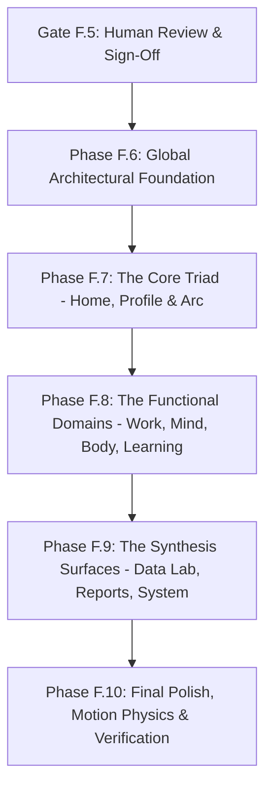

# Life OS — Winter Arc: Visual Refoundation 2.0
# Core System Specification & Design Architecture

**Author:** Agent 1 — Visual Art Director / Visual Archaeologist / Product Designer  
**Date:** September 2026  
**Status:** CANONICAL DESIGN SPECIFICATION  
**Target:** Implementation Handoff for Agent 2 (Engineers & Designers)  

---

## 1. Design Philosophy & Product Metaphor

### 1.1 The Fundamental Metaphor: The Quiet Observatory
Life OS is neither an enterprise analytics dashboard nor a gamified role-playing game. It is a **Personal Operating Environment**—a quiet observatory for the self.

* **A Dashboard** exists to summarize telemetry for an external supervisor. It shouts metrics, flashes warning indicators, and uses colored badges to manufacture urgency.
* **A Game** uses arbitrary scores, artificial streaks, and celebratory confetti to manipulate dopamine and induce repetitive actions.
* **An Observatory** is calm, precise, and dark. It does not judge the celestial bodies it watches. It collects honest signals, measures distance and momentum with scientific rigor, and provides an unclouded mirror of reality.

### 1.2 Product-Level Design DNA (The 6 Immutable Principles)

To ensure every room feels like part of the same architectural masterpiece, all surfaces must strictly adhere to these six immutable laws:

```
┌─────────────────────────────────────────────────────────────────────────────┐
│ LIFE OS ARCHITECTURAL SPECIFICATION — 6 IMMUTABLE LAWS                      │
├─────────────────────────────────────────────────────────────────────────────┤
│ 1. ARCHITECTURAL LEDGERS OVER CARDS                                         │
│    Information is separated by continuous vertical/horizontal hairline     │
│    rules and typographic weight, NEVER by floating rounded rectangles.      │
│                                                                             │
│ 2. ASYMMETRIC SWISS ANCHORING                                               │
│    Every view has a confident, left-aligned typographic anchor.             │
│    Eliminate centered "portfolio quote" layouts. Tension lives in space.    │
│                                                                             │
│ 3. TABULAR DATA PRECISION                                                   │
│    Every metric, timestamp, and quantity is rendered in aligned             │
│    tabular numerals (font-mono or font-sans tabular-nums).                  │
│                                                                             │
│ 4. TWO-TIER PROGRESSIVE DISCLOSURE                                          │
│    Surface level = Ambient clarity (1 core intention + 1 primary action)    │
│    Depth level = Full structural data revealed on interaction.              │
│                                                                             │
│ 5. TACTILE INTERACTION COMPACT                                              │
│    If an element looks like an action, it MUST execute immediately.         │
│    Never display inert mock buttons or unclickable task titles.             │
│                                                                             │
│ 6. MONOCHROME ATMOSPHERE WITH SINGLE LIVING ACCENT                          │
│    Base environment is velvety black/slate OKLCH. Exactly ONE living        │
│    accent (Emerald for momentum, Amber for reflection, Sage for recovery).   │
└─────────────────────────────────────────────────────────────────────────────┘
```

---

## 2. The Distinctive Life OS Signature

How someone will instantly recognize Life OS without a logo:

1. **The Architectural Horizon Rule:** A signature, ultra-fine horizontal hairline divider spanning the viewport that demarcates the "Current Horizon" from "The Archive".
2. **The Dual Typographic Tension:** The deliberate, master-level contrast between high-culture literary serif (`Newsreader`) and cold, exact tabular precision (`JetBrains Mono` tabular-nums).
3. **The Living Geometric Emblem (Avatar):** The avatar is neither a cartoon nor a photo nor two flat SVG wireframe circles. It is a sacred, evolving geometric construct (circles, rings, and arcs) that breathes with real-time momentum, reflects seasonal progress, and adapts to local solar time.
4. **Cardless Architecture:** Absolute absence of floating rounded boxes with box-shadows. Sections feel like carved stone tablets or high-end architectural drawings separated by light and rules.
5. **Zero AI Eyebrows:** Complete eradication of the generic tracked-out `tracking-[0.2em]` label crutch. Hierarchy is carried purely by scale, position, and tone.

---

## 3. Typographic Architecture & Domain Modes

Typography is the primary structural material of Visual Refoundation 2.0. Rather than using boxes to contain text, the text itself creates the architectural boundaries.

### 3.1 Font Stack Repair & Infrastructure
The font loading defects discovered during audit must be immediately resolved in `index.html` and `tailwind.config.js`:
1. **Editorial & Narrative:** `Newsreader` (Google Fonts variable: `ital,opsz,wght@0,6..72,200..800;1,6..72,200..800`). Optical sizing (`opsz`) must be enabled for headlines.
2. **Body & Neutral Interface:** `Geist` (Google Fonts variable: `wght@100..900`). The CSS family name is `'Geist'`, not `'Geist Sans'`.
3. **Instrument, Data & Timestamps:** `JetBrains Mono` (Google Fonts: `family=JetBrains+Mono:ital,wght@0,100..800;1,100..800`). Must be explicitly imported.

### 3.2 Domain Typographic Modes

```
┌─────────────────┬─────────────────┬───────────────────┬───────────────────────┐
│ MODE            │ TYPEFACE        │ OPTICAL TREATMENT │ DOMAINS               │
├─────────────────┼─────────────────┼───────────────────┼───────────────────────┤
│ EDITORIAL       │ Newsreader      │ opsz 36-72, 300wt │ Home, Profile, Mind,  │
│                 │ (Serif)         │ tracking-tight    │ Arc, Reports          │
├─────────────────┼─────────────────┼───────────────────┼───────────────────────┤
│ INSTRUMENT      │ JetBrains Mono  │ 400-500wt, tabular│ Work, Data Lab,       │
│                 │ (Monospace)     │ tracking-widest   │ System, Time OS       │
├─────────────────┼─────────────────┼───────────────────┼───────────────────────┤
│ KINETIC REGISTER│ Geist Display   │ 800-900wt, tabular│ Body (Fitness OS)     │
│ (Replaces Phys) │ (Heavy Sans)    │ tracking-tighter  │ Personal Records      │
├─────────────────┼─────────────────┼───────────────────┼───────────────────────┤
│ SPATIAL ATLAS   │ Geist Sans      │ 300-400wt, high   │ Learning OS,          │
│                 │ (Humanist Sans) │ line-height       │ Knowledge Vault       │
└─────────────────┴─────────────────┴───────────────────┴───────────────────────┘
```

#### Detailed Mode Specifications

#### Mode A: EDITORIAL (The Narrative Voice)
* **Domains:** Home (Hero/Intention), Profile (Personal Dossier), Mind OS (Reflections), Reports (Field Dossier), Arc (Chapter Title).
* **Intent:** Evokes literary gravitas, deep time, and philosophical reflection. Reads like a printed monograph or high-end publication.
* **Headings (H1/H2):** `Newsreader`, font-light (weight 300), optical size 72, tracking -0.02em, leading-tight.
* **Body:** `Newsreader`, font-normal (weight 400), optical size 16, text-lg, leading-relaxed, text-balance.
* **Metadata / Timestamps:** `JetBrains Mono`, text-[10px], uppercase, tracking-wider, text-text-tertiary. (NO `tracking-[0.2em]` AI eyebrows).

#### Mode B: INSTRUMENT (The Telemetry Voice)
* **Domains:** Work (Execution Terminal), Time OS (Temporal Allocation), Data Lab (Observatory), System / Command (Telemetry Core).
* **Intent:** Utilitarian, clinical, unyielding precision. Evokes terminal monitors, telemetry logs, and mechanical instrumentation.
* **Primary Figures & Timers:** `JetBrains Mono`, font-mono, tabular-nums, tracking-tight.
* **Labels & Axis Headers:** `JetBrains Mono`, text-xs, font-medium, uppercase, text-text-secondary.
* **Data Values:** Aligned on strict vertical tabular axes with zero container borders.

#### Mode C: KINETIC REGISTER (Athletic Density)
* **Replaces Loud "Physical Mode":** The previous attempt simply used `text-8xl font-black` with a single number (180 MIN) and zero workout data.
* **New Direction (Kinetic Register):** Pairs high-impact sans numerals (`Geist` 800 weight, tracking-tighter) with strict high-density exercise logs: set counters, load in kg, rep counts, and cadence markers.
* **Typography:** `Geist`, font-extrabold to font-black for primary loads and PR numbers; `JetBrains Mono` for set/rep/weight formulas (`4 × 12 @ 85kg`).

#### Mode D: SPATIAL ATLAS (The Navigational Voice)
* **Domains:** Learning OS, Roadmap Explorations, Knowledge Vault.
* **Intent:** Navigational clarity across branching intellectual paths. Reads like an expedition map or library catalog.
* **Roadmap Nodes:** `Geist Sans`, font-medium (weight 500), tracking-normal, text-balance.
* **Milestone Indicators:** `JetBrains Mono`, text-xs, uppercase, linked to chronological node lines.

---

## 4. Environmental System (OKLCH Perceptual Theming)

### 4.1 OKLCH Design Token System
Hex codes and Tailwind `slate-*` classes are strictly banned from all application code. All color values must derive from semantic OKLCH CSS variables:

```css
/* Core Semantic Token Contract */
--bg-base:          L C H;  /* Canvas background */
--bg-surface:       L C H;  /* Primary elevated spatial area */
--bg-elevated:      L C H;  /* Secondary interactive highlight */
--border-subtle:    L C H;  /* Hairline datum separator */
--border-base:      L C H;  /* Structural focus boundary */
--text-primary:     L C H;  /* Primary reading contrast (min 12:1) */
--text-secondary:   L C H;  /* Contextual prose contrast (min 7:1) */
--text-tertiary:    L C H;  /* Metadata & timestamps (min 4.5:1 WCAG AA) */
--accent-primary:   L C H;  /* Focal intention mark */
--accent-secondary: L C H;  /* Secondary harmonic marker */
--threat-critical:  L C H;  /* Critical system warning */
--threat-warning:   L C H;  /* Friction / decay indicator */
--threat-healthy:   L C H;  /* Steady state indicator */
```

### 4.2 Time-of-Day Dynamics & Environmental Modes

```
        DAWN (05:00 - 09:00)           DAY / EXECUTION (09:00 - 17:00)
    Cool, crisp, blue/indigo hue        Neutral high-contrast, razor sharp
    --bg-base: 18% 0.02 260             --bg-base: 14% 0.005 250
    Accent: Amber sunrise (75% 0.12 50)  Accent: Focus emerald (70% 0.15 150)
    Motion: Slower, deliberate           Motion: Snappy, physical, instant
               │                                       │
               ▼                                       ▼
        DUSK (17:00 - 21:00)            MIDNIGHT (21:00 - 05:00)
    Warm, introspective, sage/amber     Deep OLED black, ultra-low contrast
    --bg-base: 14% 0.02 60              --bg-base: 8% 0.005 270
    Accent: Warm copper (65% 0.15 65)    Accent: Subdued indigo (55% 0.08 270)
    Motion: Relaxed, smooth cross-fades Motion: Muted, whisper-soft
```

### 4.3 The Recovery Environment Override
When the user's Life State is diagnosed as `"Recovering"` or `"Overloaded"`, the environment dynamically shifts to `theme-recovery`:
* `--bg-base`: `16% 0.02 120` (Soft sepia/sage undertone)
* Eliminates all high-contrast alert colors; replaces critical reds with soft terracotta.
* Motion duration increases to 400ms spring easing to reduce sensory stimulation.
* All non-essential telemetry and statistics are automatically suppressed from the primary viewport.

---

## 5. Composition Over Cards: The 8 Primitives

Instead of boxing information into rounded rectangles, Visual Refoundation 2.0 introduces **8 Compositional Primitives**:

```
┌───────────────────────────────────────────────────────────────────────────────┐
│                               1. STAGE                                        │
│   Full-bleed spatial clearing for the primary daily focal point.              │
│   No borders. Uses macro-whitespace (py-24 to py-36) and asymmetric anchor.   │
├───────────────────────────────────────────────────────────────────────────────┤
│                               2. RAIL                                         │
│   Continuous vertical or horizontal alignment spine.                          │
│   Hairline datum (1px border-subtle) guiding chronological/tabular flow.      │
├───────────────────────┬───────────────────────────────┬───────────────────────┤
│       3. FIELD        │          4. LEDGER            │      5. TERMINAL      │
│  Tabular data matrix. │  Continuous scroll history.   │  High-density monosp. │
│  Aligned on numbers.  │  Node points on a vertical    │  execution workspace. │
│  No cell borders.     │  hairline rail.               │  Zero chrome borders. │
├───────────────────────┴───────────────────────────────┴───────────────────────┤
│                               6. CHRONICLE                                    │
│   Editorial two-column narrative layout (prose + pull quotes).               │
├───────────────────────────────────────────────────────────────────────────────┤
│                               7. ATLAS                                        │
│   Spatial journey graph with milestone nodes and branching trajectories.      │
├───────────────────────────────────────────────────────────────────────────────┤
│                               8. SURFACE                                      │
│   Floating spatial layer reserved STRICTLY for contextual interaction         │
│   (command palettes, quick logging sheets, detail inspectors).                │
└───────────────────────────────────────────────────────────────────────────────┘
```

1. **Stage:** Primary conscious intention anchor (`Home`, `Profile`, `Arc`).
2. **Rail:** Alignment spine connecting chronological nodes.
3. **Field:** Clean horizontal metric clusters separated by whitespace gutters, never boxes.
4. **Ledger:** Tabular accounting rows with hairline dividers (`border-b border-border-subtle`).
5. **Terminal:** Keyboard-driven monospaced execution workspace (`Work`, `Time OS`).
6. **Chronicle:** Two-column editorial reading layout for journals and field reports.
7. **Atlas:** Branching knowledge trajectories and roadmap paths (`Learning OS`).
8. **Surface (Restricted):** Floating layer strictly for command palette (`Cmd+K`) and action sheets.

---

## 6. Domain Personalities (The 10 Distinct Rooms)

Each room has a unique emotional function and architectural metaphor, expressed through typography and density:

```
ROOM 1: HOME [The Porch / The Foyer]
- Function: Ambient grounding, daily orientation, primary launchpad.
- Typographic Tone: Editorial Newsreader headline + clean functional sans action.
- Rhythm: Expansive, calm, uncluttered, asymmetrically anchored.

ROOM 2: ARC [The Grand Hall]
- Function: Seasonal narrative, chapter countdown, transformative milestones.
- Typographic Tone: Monumental Newsreader serif display + tabular dates.
- Rhythm: Cinematic, slow, historic.

ROOM 3: MIND OS [The Study / The Sanctuary]
- Function: Introspective reflection, psychological clarity, habit rhythm.
- Typographic Tone: Literary Newsreader serif body + quiet monospaced timestamps.
- Rhythm: Intimate, quiet, warm, unified editorial ledger.

ROOM 4: WORK OS [The Workshop / The Terminal]
- Function: High-velocity task execution, sprint planning, deep work timers.
- Typographic Tone: High-precision JetBrains Mono + crisp structural sans.
- Rhythm: Fast, sharp, dense, keyboard-driven.

ROOM 5: BODY OS [The Gymnasium / The Forge]
- Function: Physical output, workout tracking, personal records, consistency.
- Typographic Tone: Heavy, grounded, ultra-bold sans-black figures + mono units.
- Rhythm: Kinetic, punchy, visceral.

ROOM 6: LEARNING OS [The Library / The Map Room]
- Function: Knowledge acquisition, skill roadmaps, reading field notes.
- Typographic Tone: Balanced humanist sans + indented editorial blockquotes.
- Rhythm: Exploratory, structured, intellectual.

ROOM 7: PROFILE & PROGRESSION [The Dossier / The Archives]
- Function: Identity archetype, earned badges, lifetime chapter ledger.
- Typographic Tone: Formal archival typography + heraldic geometric insignia.
- Rhythm: Ceremonial, earned, permanent.

ROOM 8: DATA LAB [The Observatory]
- Function: Multi-domain telemetry cross-correlation, pattern discovery.
- Typographic Tone: Clinical tabular monospace + crisp data-viz markings.
- Rhythm: Observational, cool, analytical, 30/90-day zoomable horizon.

ROOM 9: REPORTS [The Sunday Paper / Field Dossier]
- Function: Weekly synthesis, wins, friction analysis, tactical adjustments.
- Typographic Tone: Broadsheet serif columns + structured hairline ledger.
- Rhythm: Archival, reflective, documentary.

ROOM 10: SYSTEM [The Machine Room]
- Function: Telemetry health, Brain Engine diagnostics, background sync.
- Typographic Tone: Monochrome Swiss instrumentation + status indicators.
- Rhythm: Diagnostic, understated, invisible unless needed.
```

---

## 7. Navigation Architecture & Living Horizon

### 7.1 Dismantling the SaaS Admin Sidebar
The existing 80px/288px collapsible sidebar is an administrative artifact. It treats Life OS like a multi-tenant SaaS dashboard with 9 disconnected apps.

### 7.2 The Living Horizon (New Navigation Model)

```
DESKTOP (> 1024px):
┌───────────────────────────────────────────────────────────────────────────────┐
│ [LIVING EMBLEM]      HOME • ARC • MIND • WORK • BODY • INTELLECT   TIME: 14:32 │
│ (Quiet top rail or docked left living horizon — integrated into page canvas)  │
├───────────────────────────────────────────────────────────────────────────────┤
│                                                                               │
│                               PAGE CANVAS                                     │
│                                                                               │
└───────────────────────────────────────────────────────────────────────────────┘

MOBILE (< 640px):
┌───────────────────────────────────────────────────────────────────────────────┐
│                                                                               │
│                               PAGE CANVAS                                     │
│                                                                               │
├───────────────────────────────────────────────────────────────────────────────┤
│ [ HOME ]       [ FOCUS ]         [ QUICK LOG (+) ]       [ REFLECT ]          │
│ (Living thumb dock: 4 tactile touch anchors + central contextual action)      │
└───────────────────────────────────────────────────────────────────────────────┘
```

1. **Consolidate Navigation into Primary Horizons:** Home, Arc, Mind, Work, Body, Intellect, Reports.
2. **Subsystem Navigation via In-Page Typographic Flow:** Eliminate `ModuleHeader` cards and sub-tabs.
3. **Global Command Horizon (`Cmd+K`):** Universal quick-jump and quick-log mechanism.

---

## 8. Avatar & Identity: The Living Geometric Emblem

### 8.1 Re-Architecting Avatar.tsx
The Avatar is neither a cartoon nor two flat SVG circles. It is a **Generative Composable Geometric Emblem**:

```
                  ┌───────────────────────┐
                  │    ATMOSPHERIC LIGHT  │  <- Reacts to Time-of-Day (Dawn amber,
                  │       (Backdrop)      │     Noon daylight, Midnight indigo)
                  ├───────────────────────┤
                  │     OUTER CHAPTER     │  <- Arc Season Ring (progress arc)
                  │         RING          │
                  ├───────────────────────┤
                  │    MOMENTUM VECTOR    │  <- Breathing Geometric Core
                  │        LATTICE        │     (Circles, rings, arcs)
                  ├───────────────────────┤
                  │    EARNED PRESTIGE    │  <- Winter Arc Mantle, Scholar Mark,
                  │        MARKERS        │     Kinetic Glyph
                  └───────────────────────┘
```

1. **Time-of-Day Atmospheric Glow:** Radial OKLCH gradient aura.
2. **Life State Dynamics:** Fast, sharp geometric resonance during `Accelerating`; soft, damped breathing during `Recovering`.
3. **Earned Milestones:** Geometric crest additions based on verifiable telemetry (ADR-016).

---

## 9. Anti-Pattern Blacklist

Any agent implementing UI in Life OS is strictly forbidden from introducing:

1. **The Rounded-XL Card Trap:** Wrapping content in `<article className="rounded-xl border border-border bg-surface p-4">`.
2. **The "AI Eyebrow" Crutch:** Prepended uppercase tracked monospace labels (`text-xs font-mono uppercase tracking-[0.2em]`).
3. **The 4-Card KPI Grid:** Four identical boxed stats in a row.
4. **The Neon Glow Dot:** Status indicators with `shadow-[0_0_8px_rgba(...)]`.
5. **The Bottom-Right FAB Cluster:** Random floating `+` buttons.
6. **Rogue Hex Codes:** Bypassing OKLCH with `#111111`, `#222222`, `#333333`, `bg-black`, `slate-*`.
7. **Hardcoded Metrics:** Showing `"Level 12"`, `"3 Pending Actions"` without verified data backing.
8. **Inert Action Affordances:** Buttons or links with no `onClick` or route handler.
9. **Cyberpunk Terminal Cosplay:** Fake ASCII brackets (`[ ... ]`, `// ACTIVE_CONTEXT`) on static text.
10. **Appended Animated Arrows:** Buttons decorated with `group-hover:translate-x-0` `→` arrows.
11. **Single Italicized Words:** Headlines featuring a single italic word (`Chapter: *Drifting*`).
12. **Copy-Pasted Left-Border Timelines:** Duplicating the identical vertical rule + circle bullet across different domains.
13. **Military Threat Language:** Calling missed habits or workouts `"CRITICAL SYSTEM THREATS"`.
14. **Emoji Mood Overdose:** Using cartoony emojis (😭, 🔥) on serious reflection surfaces.
15. **Dashed-Border Empty States:** Generic AI-style dashed boxes with an icon and empty text.

---

## 10. Visual Evolution Plan (The Path Forward)



### Step 1: Repair the Typographic & Global Shell Foundation (Phase F.6)
* Fix `index.html` and `tailwind.config.js` to load `Geist`, `Newsreader`, and `JetBrains Mono`.
* Add Reports (`/reports`) and Arc (`/arc`) to navigation.
* Fix `shellTitle.ts` so Home shows "Home" or "Life OS", not "Mission Control".
* Purge all hardcoded "Level 12" and "3 Pending Actions" fabrications.
* Purge all `tracking-[0.2em]` AI eyebrows.

### Step 2: The Core Triad — Home, Profile & Arc (Phase F.7)
* **Home:** Asymmetric Swiss anchor. Primary CTA connects directly to starting Deep Work or declaring intention.
* **Profile:** Rebuild as personal identity dossier with living geometric avatar, earned season titles, and core attributes.
* **Arc:** Build the missing `/arc` route: seasonal chapter countdown, transformation objectives, and milestone ledger.
* **Avatar:** Re-architect into generative geometric SVG emblem reacting to life state and momentum.

### Step 3: Refound the Execution Domains — Work, Mind, Body, Learning (Phase F.8)
* **Work OS:** Replace ASCII cosplay with live keyboard-navigable execution queue with instant completion and focus timer triggers.
* **Mind OS:** Deprecate legacy rounded cards in `HabitsPage` and `JournalPage`; create unified reflection logbook.
* **Body OS:** Maintain bold typographic scale; add real session launcher, volume curve, and PR shelf.
* **Learning OS:** Replace generic left-border timeline with architectural book shelf and spatial roadmap path.

### Step 4: Refound the Synthesis Surfaces — Data Lab, Reports, System (Phase F.9)
* **Data Lab:** Restore real multi-domain cross-correlation (Sleep × Deep Work × Training × Mood) on zoomable 30/90-day horizon canvas.
* **Reports:** Link in navigation; automatically compile weekly achievements into Sunday paper dossier even when unwritten.
* **System:** Restructure Mission Control from colorful SaaS dashboard into crisp, monochrome Swiss diagnostic console.

### Step 5: Final Polish, Motion Physics & Verification (Phase F.10)
* Implement spring-damped transition physics and mobile bottom navigation dock.
* Complete cross-domain regression audit verifying 100% cardless compliance.
