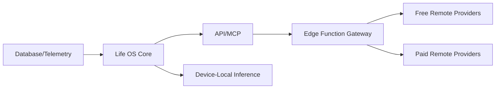

# Winter Arc: API, MCP, and AI Gateway

> [!NOTE]
> This document details the external integration surfaces of Life OS, encompassing the standard API, Model Context Protocol (MCP) server, AI Gateway routing, and related security architectures. These capabilities are primarily targeted for Waves 8 and 9 of the Winter Arc.

**Status**: [FUTURE]

## 1. API Architecture

The API layer sits between the core Life OS system and external consumers (such as mobile apps, custom scripts, or external automation). 

**Recommendation**: Start with Supabase Edge Functions as a thin API proxy with scope enforcement, mapping down to Supabase PostgREST for the underlying data access.

### 1.1 Read Capabilities (Scopes)

| Scope | Data Exposed | Target Tables/Views |
|-------|-------------|-------------|
| `life.read` | System-level status | `current_day_snapshot`, `system_metrics` |
| `mind.read` | Habits, streaks, journal entries | `habits`, `habit_logs`, `journal_entries` |
| `fitness.read` | Workouts, exercises, PRs | `workouts`, `exercise_logs`, `fitness_exercises` |
| `learning.read` | Roadmaps, sessions, progress | `learning_*` tables and views |
| `productivity.read` | Tasks, plans, goals | `tasks`, `weekly_plans`, `goals` |
| `time.read` | Focus sessions | `time_logs` |
| `finance.read` | Transactions | `transactions` |
| `analytics.read` | Data Lab metrics | `data_lab_*` views |
| `season.read` | Season progress | `seasons` [FUTURE] |

### 1.2 Write Capabilities (Scopes)

| Scope | Allowed Actions |
|-------|----------------|
| `mind.write` | Create habit log, create journal entry |
| `fitness.write` | Create workout, log exercise |
| `learning.write` | Log learning session |
| `productivity.write` | Create task, update task status |
| `time.write` | Start/log focus session |
| `finance.write` | Add transaction |
| `life.write` | Trigger Evening Sync |

### 1.3 Administrative Capabilities

| Scope | Allowed Actions |
|-------|----------------|
| `admin.tokens` | Create/revoke API tokens |
| `admin.audit` | Read audit trail |

### 1.4 API Non-Functional Requirements

- **Authentication**: API tokens are hashed and stored in the `api_tokens` table. Each token has explicit scopes and inherits the `user_id` for Supabase RLS enforcement. Token rotation, expiry, and immediate revocation are supported.
- **Authorization**: Scope-based access control with a default policy of LEAST PRIVILEGE. Write scopes require explicit opt-in. Administrative scopes are kept strictly separate.
- **Rate Limiting**: Enforced per-token. Recommended baselines: `100 req/min` for reads, `30 req/min` for writes. Returns `429 Too Many Requests` when exceeded.
- **Error Behavior**: Standard HTTP status codes (`401`, `403`, `404`, `429`, `500`) with structured JSON responses: `{ error: string, code: string, details?: any }`.
- **Audit Trail**: Every external API mutation is logged to `api_audit_log` (fields: `id`, `user_id`, `token_id`, `method`, `path`, `payload_hash`, `ip_address`, `timestamp`). Emit canonical telemetry events (`api.mutation.external`).

## 2. Model Context Protocol (MCP) Server

The MCP server exposes Life OS data directly to AI agents in a structured, tool-consumable format.

- **Defaults**: Read-only access by default.
- **Structure**: Explicit tool definitions map to specific data scopes and API endpoints.

### 2.1 MCP Tools (Read)

- `get_system_status`: Retrieve current momentum, Life State, and active directive.
- `get_habits`: Today's habits and completion status.
- `get_tasks`: Pending tasks.
- `get_focus_stats`: Today's focus time.
- `get_workout_history`: Recent workouts.
- `get_learning_progress`: Active roadmaps and progress.
- `get_weekly_report`: This week's summary.

### 2.2 MCP Tools (Write) — *If Enabled*

- `log_habit`: Mark habit as complete.
- `create_task`: Add a task.
- `log_focus`: Log a focus session.
- `log_workout`: Log a workout.
- `add_expense`: Add a transaction.

### 2.3 MCP Security

- **Authorization Boundary**: MCP uses the exact same authorization boundary as the REST API (same tokens, scopes, and RLS enforcement). There is no MCP direct database access.
- **No Unrestricted Writes**: Write privileges are explicitly granted.
- **Audit Logging**: All MCP-driven mutations are routed through the standard audit trail.
- **Privacy Controls**: The server strictly respects user privacy preferences (see AI Gateway Privacy Rules).

## 3. AI Gateway

The AI Gateway orchestrates where and how data is processed. The AI Gateway does not directly access the database; it strictly routes requests through the established API/MCP boundaries. Sensitive data uses device-local inference where applicable, while remote AI requests are routed through an Edge Function gateway.

### 3.1 Architecture Pipeline

### 3.2 Routing Rules

| Task Type | Preferred Provider | Fallback |
|-----------|-------------------|----------|
| Simple summaries | Device-local inference | Free provider |
| **Journal analysis** | **Device-local inference (sensitive)** | **None (local only)** |
| Weekly report narrative | Free provider | Paid model |
| Complex pattern explanation | Paid model | Free provider |
| Book/video takeaway extraction | Free provider | Paid model |
| Natural language system query | Device-local inference | Free provider |

### 3.3 Privacy & Routing Strictures

- **Journal content**: LOCAL ONLY. Never transmitted to external providers.
- **Financial data**: LOCAL ONLY, unless explicit opt-in to external routing is granted.
- **Personal Identity**: NEVER sent to external providers.
- **Habit/Fitness Data**: Permitted to external providers.
- **Aggregated Stats**: Permitted to external providers.

### 3.4 Functional Use Cases for AI

1. Weekly/monthly report narrative generation
2. Journal entry summarization (local only)
3. Pattern explanation ("Why was this week different?")
4. Book/video takeaway extraction
5. Reflection prompt generation
6. Recovery root-cause analysis
7. Natural language system querying ("How many hours did I focus this month?")

### 3.5 Operational Guarantees

> [!IMPORTANT]
> The AI integration must follow strict architectural invariants regarding authority and data integrity.

- **Data Integrity**: AI responses MUST distinguish between observed data, inferences, and suggestions.
- **Never Authoritative**: AI is NEVER authoritative. It MUST NOT invent Life OS data or act as an authoritative scoring engine.
- **Non-Destructive**: AI MUST NOT silently modify personal data. Outputs are advisory and never directly mutate records without explicit user confirmation/audit.
- **Failure Isolation**: 
  - If the preferred AI provider fails, gracefully degrade or route to the fallback.
  - If device-local inference fails, fall back to a free provider *only if data is non-sensitive*.
  - If all providers fail, fall back to presenting raw data without narrative.
  - AI failures MUST NEVER block core Life OS functionality.

### 3.6 Provider Configuration

- **Local**: Device-local inference (e.g., Android on-device ML).
- **Free**: Gemini Flash free tier, other free APIs.
- **Paid**: OpenAI, Anthropic, Google AI (via user-provided API keys).
- **Controls**: Monthly budget caps and token usage tracking.
- **Requirements**: Enforced minimum context windows and structured output support for designated capabilities.

## 4. Security Subsystem

### General Principles

- **Row Level Security**: Preserve Supabase RLS on ALL entities.
- **Service Keys**: Zero client exposure of backend service keys.
- **Mobile Auth**: Mobile authentication uses the standard Supabase Auth flow.
- **Cryptographic Storage**: API tokens use secure hashing (e.g., bcrypt/argon2).
- **Audit**: All external mutations are logged.
- **Secrets Management**: Secrets are strictly excluded from version control.

### Integration Permissions

- Features per-integration permission grants.
- Grants are visible in a dedicated settings UI and are revocable at any time.
- Each integration maintains a discrete activity log.

---
## Related Documentation

- [Master Plan](./WINTER_ARC_MASTER_PLAN.md)
- [Architecture](./WINTER_ARC_ARCHITECTURE.md)
- [Data Model](./WINTER_ARC_DATA_MODEL.md)
- [System Architecture](../architecture/SYSTEM_ARCHITECTURE.md)
- [AI Engineering Constitution](../decisions/AI_ENGINEERING_CONSTITUTION.md)
