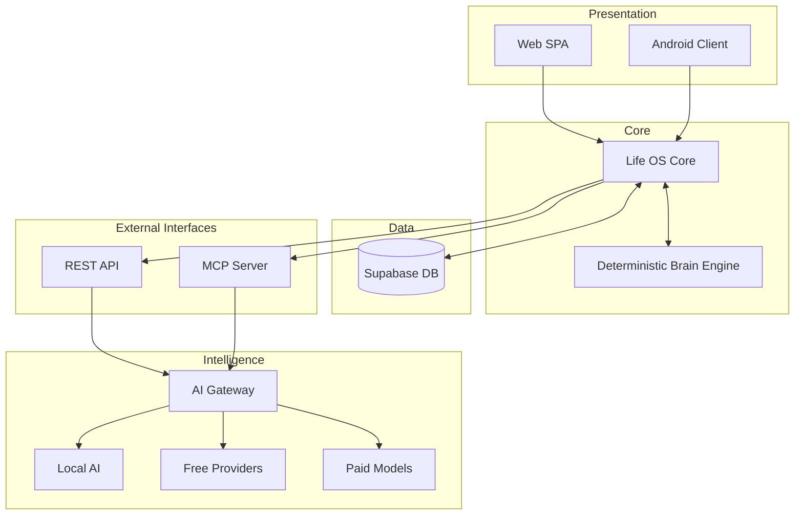
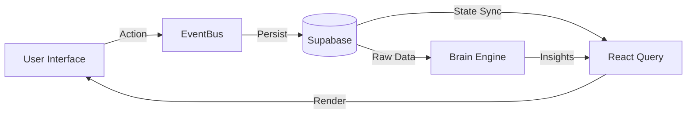
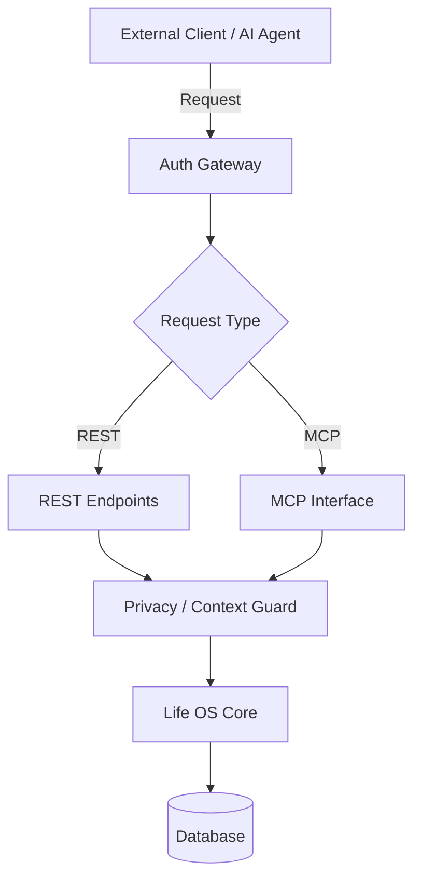
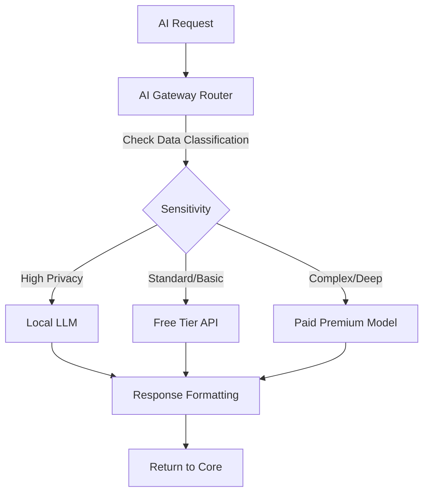
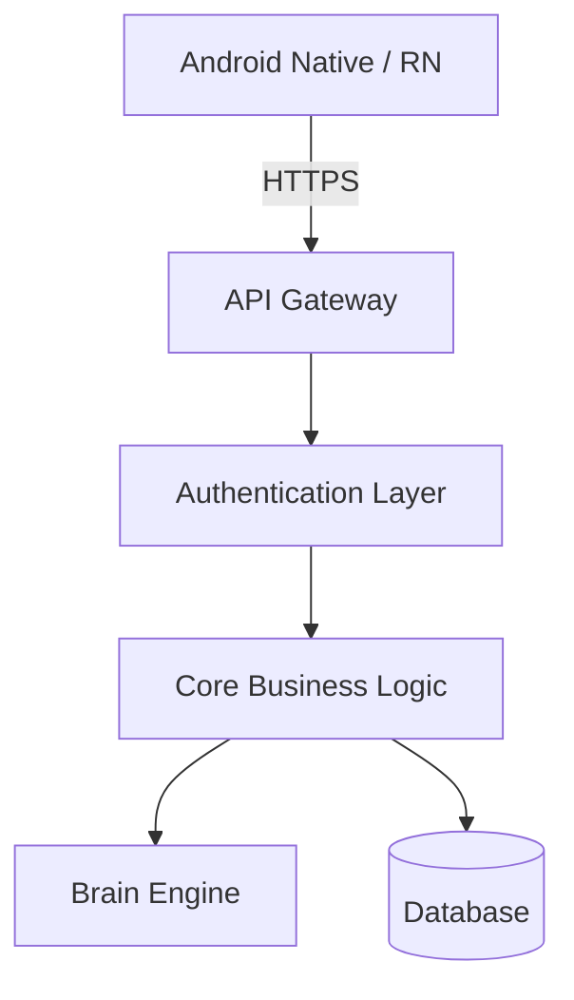

> [!WARNING]
> **HISTORICAL ARCHIVE**: This document is preserved for historical reference and architectural intent only. It does not reflect the current production implementation, active database schema, or live routes. For current specifications, refer to `docs/architecture/SYSTEM_ARCHITECTURE.md`, `docs/architecture/DATABASE_SCHEMA.md`, and `docs/AGENT_QUICKSTART.md`.

# Winter Arc Architecture Evolution

This document outlines the intended high-level architectural evolution for the Winter Arc campaign. It establishes the baseline, the target state, and the critical invariants that must be maintained during the transition.

## CURRENT ARCHITECTURE (Phase 1 Baseline)

```text
BROWSER CLIENT (SPA)
React 19 + TypeScript 5.9 + Vite 7 + Tailwind CSS 3.4 + React Router 7
State: TanStack React Query v5 + Zustand v5 (event queue)
    ↓
SUPABASE POSTGRESQL 15+
27 Base Tables + 15 SQL Views (security_invoker = true)
RLS on all tables (auth.uid() = user_id)
    ↓
CLIENT-SIDE BRAIN ENGINE
Deterministic TypeScript Intelligence
(analyzeMomentum, domainSignals, generateDirectives, systemHealthEvaluator)
    ↓
EXECUTIVE PRESENTATION
Mission Control + Document PiP + Evening Sync
```

## TARGET ARCHITECTURE (Winter Arc)

```text
                    LIFE OS
                       │
        ┌──────────────┴──────────────┐
        │                             │
      WEB (SPA)                   ANDROID
        │                             │
        └──────────────┬──────────────┘
                       │
                LIFE OS CORE
                       │
              DATABASE / TELEMETRY
                       │
             DETERMINISTIC ENGINE
                       │
                 API / MCP
                       │
                 AI GATEWAY
                       │
          ┌────────────┼────────────┐
          │            │            │
        LOCAL        FREE         PAID
         AI         PROVIDERS     MODELS
```

## Critical Architectural Principles

1. **API/MCP comes BEFORE the AI layer** - AI never accesses data directly. It must request data through the API layer.
2. **AI is optional** - The system works 100% without AI. Core functionality relies on deterministic rules.
3. **AI does not become source of truth** - The Deterministic Brain Engine remains authoritative.
4. **External AI receives only permitted data** - Strict privacy-aware routing applies to all outbound AI requests.
5. **Local AI preferred for sensitive/private processing** - Whenever possible, fallback to local models for protected data.
6. **Existing foundation is NOT being rewritten** - This is an experience evolution, not a tear-down of the Phase 1 base.

## Layer Definitions

* **Presentation Layer** (Web + Mobile): The user interface, encompassing the existing React SPA and the planned Android client.
* **Application Core**: React hooks, state management (Zustand, React Query), and core business logic.
* **Intelligence Layer**: The client-side Brain Engine providing deterministic insights (momentum analysis, health evaluation).
* **Data Layer**: Supabase PostgreSQL, SQL views, RLS policies, and the canonical telemetry event store.
* **API Layer** (*New in Winter Arc*): REST API and Model Context Protocol (MCP) server endpoints exposing Life OS capabilities to external tools safely.
* **AI Layer** (*New in Winter Arc*): AI Gateway and Provider Router for managing prompts, routing requests, and aggregating responses from local/free/paid models.

## Integration Boundaries

| Boundary | Status | Description |
| :--- | :--- | :--- |
| **Web ↔ Core** | Existing, Enhanced | SPA integration with React Query/Zustand layer. |
| **Mobile ↔ Core** | New | Mobile communication via shared API endpoints. |
| **Core ↔ Database** | Existing, Protected | Direct connection to Supabase via securely scoped clients. |
| **API ↔ External Tools** | New | Secured endpoints for third-party scripts/tools. |
| **MCP ↔ AI Agents** | New | Standardized Model Context Protocol for LLM tool use. |
| **AI Gateway ↔ Models** | New | Privacy-aware router managing provider integrations. |

## Evolution Zones

### 🔴 Protected Zones (Red Light)
*Do NOT modify without explicit architectural review.*
* EventBus transactional persistence (`useEventBus.ts`)
* RLS policies on all tables
* Base table schemas
* Cognitive boundary (Mind OS ↔ Productivity Hub)
* Brain Engine deterministic logic
* Canonical event taxonomy (`eventTaxonomy.ts`)

### 🟡 Modification Zones (Yellow Light)
*Modify with caution. Additive changes preferred.*
* SQL views (additive preferred)
* Brain Engine weights/formulas
* New canonical events
* React Query cache keys

### 🟢 Evolution Zones (Green Light)
*Safe for active development and experimentation.*
* UI components, styling, layouts
* New routes and pages
* New API endpoints
* New mobile client
* Missing Learning OS UI modals

## Architecture Diagrams

### 1. Overall System Architecture


### 2. Data Flow Diagram


### 3. API/MCP Layer Design


### 4. AI Gateway Routing


### 5. Mobile Integration Pattern


## Cross-References
* [System Architecture](../architecture/SYSTEM_ARCHITECTURE.md)
* [Database Schema](../architecture/DATABASE_SCHEMA.md)
* [Architecture Decisions](../decisions/ARCHITECTURE_DECISIONS.md)
* [Winter Arc Master Plan](WINTER_ARC_MASTER_PLAN.md)
* [Historical Baseline Snapshot (Phase 1)](../historical/PHASE1_BASELINE_SNAPSHOT_ad488a2.md)
* [Agent Quickstart](../AGENT_QUICKSTART.md)
