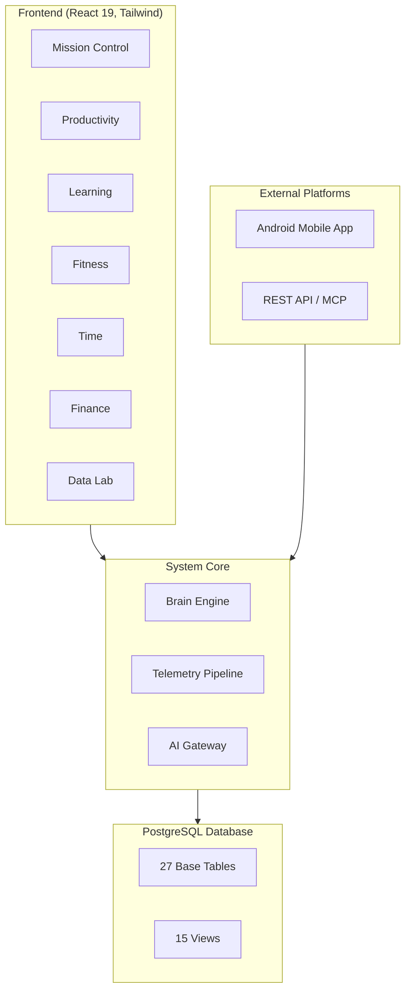

# Winter Arc Master Plan

> **STATUS: VISUAL REFOUNDATION & DATABASE REMEDIATION VERIFIED (GREEN BASELINE)**
> *Visual language, Living Horizon shell, and Supabase database schemas (`life_seasons`, `user_achievements`, `pulse_logs`, etc.) are deployed and verified. Current focus: Admin Control Layer (ADR-023), Recovery OS Grief Protocol (ADR-024), and AI Curriculum Ingestion (ADR-025).*

## Executive Summary
This document serves as the central command center and feature inventory for the Winter Arc evolution of Life OS. It maps out 46 distinct features across 9 implementation waves, providing a structured blueprint from the current baseline to the target state. It establishes the architectural dependencies, required workstreams, and integration points for every planned feature.

## Critical References
- [Current State Context](../../LIFE_OS_FINAL_CURRENT_STATE_CONTEXT.md)
- [Winter Arc Master Spec](./WINTER_ARC_MASTER_SPEC.md)
- [Forensic System Remediation & Cleanliness Audit](./WINTER_ARC_SYSTEM_REMEDIATION_AND_AUDIT_2026.md)

## Conceptual Architecture Diagram

## Implementation Sequence Summary

> **NOTE: Implementation sequence has been updated to Phases A-K under the Multi-Agent Model.**
> The original Wave 1-9 structure has been superseded by a domain-specific specialist structure.
> Refer to [Implementation Sequence](./WINTER_ARC_IMPLEMENTATION_SEQUENCE.md) for the authoritative Phases (A through K) and Agent responsibilities.

## Change Impact Matrix

| Feature | FE | DB | Tel | Mob | API | MCP | AI | Sec | Docs | Risk |
|---------|----|----|-----|-----|-----|-----|----|-----|------|------|
| F-01 to F-07 | High | Med | Med | Low | Low | Low | Low | Low | High | Med |
| F-08 to F-14 | Low | Low | High | High | High | Low | Low | Med | Med | High |
| F-15 to F-19 | High | High | Med | Low | Low | Low | Low | Low | Med | Med |
| F-20 to F-23 | High | High | Low | Low | Low | Low | Low | Low | Low | Low |
| F-24 to F-26 | High | Low | Low | Low | Low | Low | Low | Low | Low | Low |
| F-27 to F-31 | High | Low | Low | Med | Low | Low | Med | Low | Low | Low |
| F-32 to F-35 | High | High | Med | Low | Low | Low | Med | Low | Med | Med |
| F-36 to F-39 | Low | High | High | High | High | High | Low | High | High | High |
| F-40 to F-44 | Med | Low | Low | Low | Med | Low | High | Low | Med | High |

## Complete Feature Inventory

Wave 1 - IDENTITY (F-01 to F-07)

### F-01: Winter Arc Design System & Visual Identity
- **Feature Family:** IDENTITY
- **User Purpose:** Modernize the interface with a true-black OLED aesthetic and cohesive design language.
- **Current State:** [UI MISSING]
- **Target State:** Comprehensive Tailwind 3.4 configuration, unified component library, consistent spacing and typography.
- **Dependencies:** None
- **Affected Modules:** All UI Modules
- **Frontend Work:** Rebuild core components, update Tailwind config.
- **Backend/Database Work:** None
- **Telemetry Implications:** None
- **Mobile Implications:** Foundation for mobile visual language.
- **API/MCP Implications:** None
- **AI Implications:** None
- **Security Implications:** None
- **Documentation Dependencies:** Design System Docs
- **Verification Requirements:** Visual regression testing.
- **Implementation Wave:** 1
- **Complexity Estimate:** Medium
- **Risk Level:** Low
- **Non-Goals:** Rebuilding the routing or state management.

### F-02: Avatar Foundation & Visual Representation
- **Feature Family:** IDENTITY
- **User Purpose:** Gamify the user experience with a personalized visual avatar.
- **Current State:** [FUTURE]
- **Target State:** A visual avatar component integrated into Mission Control.
- **Dependencies:** F-01
- **Affected Modules:** Mission Control
- **Frontend Work:** Composable SVG avatar rendering component (ADR-013).
- **Backend/Database Work:** New tables for avatar state and cosmetics.
- **Telemetry Implications:** Avatar update events.
- **Mobile Implications:** Needs mobile-friendly rendering.
- **API/MCP Implications:** Read-only avatar state API.
- **AI Implications:** None
- **Security Implications:** Standard RLS.
- **Documentation Dependencies:** Avatar System Docs
- **Verification Requirements:** Ensure correct rendering across screen sizes.
- **Implementation Wave:** 1
- **Complexity Estimate:** Medium
- **Risk Level:** Low
- **Non-Goals:** Complex 3D rendering.

### F-03: Personal Attribute Stats (Focus, Discipline, Consistency, Learning, Execution, Physical, Recovery)
- **Feature Family:** IDENTITY
- **User Purpose:** Quantify user characteristics (Focus, Discipline, etc.) based on telemetry.
- **Current State:** [FUTURE]
- **Target State:** Dynamic stats calculated from Brain Engine data.
- **Dependencies:** Brain Engine
- **Affected Modules:** Mission Control, Brain Engine
- **Frontend Work:** Stat visualization components (radar charts).
- **Backend/Database Work:** Attribute calculation logic (SQL/Cron).
- **Telemetry Implications:** Map existing events to attribute weights.
- **Mobile Implications:** Dashboard widget.
- **API/MCP Implications:** Read-only stats endpoint.
- **AI Implications:** None
- **Security Implications:** None
- **Documentation Dependencies:** Attribute Calculation Logic
- **Verification Requirements:** Unit tests for calculation accuracy.
- **Implementation Wave:** 1
- **Complexity Estimate:** High
- **Risk Level:** Medium
- **Non-Goals:** Manual editing of stats.

### F-04: Life State System (Recovering, Stable, Building, Accelerating, Overloaded, Drifting)
- **Feature Family:** IDENTITY
- **User Purpose:** Automatically categorize the user's current life momentum.
- **Current State:** [FUTURE]
- **Target State:** State determination logic based on momentum EMA.
- **Dependencies:** Brain Engine (momentum EMA α=0.6)
- **Affected Modules:** System, Mission Control
- **Frontend Work:** UI indicators for current state.
- **Backend/Database Work:** State thresholds config and historical tracking.
- **Telemetry Implications:** State transition events.
- **Mobile Implications:** Push notification on state change.
- **API/MCP Implications:** Webhook on state change.
- **AI Implications:** None
- **Security Implications:** None
- **Documentation Dependencies:** Life State Definitions
- **Verification Requirements:** Simulate momentum changes and verify state transitions.
- **Implementation Wave:** 1
- **Complexity Estimate:** Medium
- **Risk Level:** Low
- **Non-Goals:** Predictive state modeling.

### F-05: Mission Control Redesign
- **Feature Family:** IDENTITY
- **User Purpose:** Provide a unified, high-density dashboard combining widgets, stats, and active tasks. Mission Control evolves into Home.
- **Current State:** [UI MISSING]
- **Target State:** Modular, customizable grid dashboard.
- **Dependencies:** F-01, F-02, F-03, F-04
- **Affected Modules:** Mission Control
- **Frontend Work:** Grid layout engine, widget components.
- **Backend/Database Work:** User preferences for layout.
- **Telemetry Implications:** Widget interaction tracking.
- **Mobile Implications:** Responsive stack layout for mobile.
- **API/MCP Implications:** None
- **AI Implications:** None
- **Security Implications:** None
- **Documentation Dependencies:** Mission Control Layout Spec
- **Verification Requirements:** Cross-browser layout testing.
- **Implementation Wave:** 1
- **Complexity Estimate:** High
- **Risk Level:** Medium
- **Non-Goals:** Deep functionality within widgets (they should link to modules).

### F-06: Theme System (Winter Arc, Dawn, Midnight, Command, Recovery)
- **Feature Family:** IDENTITY
- **User Purpose:** Allow visual customization based on time of day or life state.
- **Current State:** [FUTURE]
- **Target State:** CSS variable-based theming engine supporting Winter Arc, Dawn, Midnight, Command, Recovery.
- **Dependencies:** F-01
- **Affected Modules:** All UI Modules
- **Frontend Work:** Theme provider context, CSS variable injection.
- **Backend/Database Work:** Persist selected theme.
- **Telemetry Implications:** None
- **Mobile Implications:** Theme sync to mobile app.
- **API/MCP Implications:** None
- **AI Implications:** None
- **Security Implications:** None
- **Documentation Dependencies:** Theme Palette Spec
- **Verification Requirements:** Verify contrast ratios for all themes.
- **Implementation Wave:** 1
- **Complexity Estimate:** Medium
- **Risk Level:** Low
- **Non-Goals:** User-generated custom themes.

### F-07: Navigation & Sidebar Overhaul
- **Feature Family:** IDENTITY
- **User Purpose:** Streamline access to the 8 user-facing modules.
- **Current State:** [UI MISSING]
- **Target State:** Collapsible, keyboard-navigable sidebar with quick actions.
- **Dependencies:** F-01
- **Affected Modules:** Core Shell
- **Frontend Work:** Sidebar component, routing updates.
- **Backend/Database Work:** None
- **Telemetry Implications:** Navigation path tracking.
- **Mobile Implications:** Bottom tab navigation translation.
- **API/MCP Implications:** None
- **AI Implications:** None
- **Security Implications:** None
- **Documentation Dependencies:** Information Architecture
- **Verification Requirements:** Accessibility (a11y) testing.
- **Implementation Wave:** 1
- **Complexity Estimate:** Low
- **Risk Level:** Low
- **Non-Goals:** Complex nested routing.

Wave 2 - DAILY PRESENCE (F-08 to F-14)

### F-08: Android Mobile Application Foundation
- **Feature Family:** DAILY PRESENCE
- **User Purpose:** Native mobile access to core Life OS features.
- **Current State:** [FUTURE]
- **Target State:** Native Android (Kotlin + Jetpack Compose) application connected to the backend.
- **Dependencies:** API (F-36)
- **Affected Modules:** Mobile App
- **Frontend Work:** App scaffold, auth flow, core navigation.
- **Backend/Database Work:** Mobile device registration.
- **Telemetry Implications:** Mobile-specific context tags.
- **Mobile Implications:** Core deliverable.
- **API/MCP Implications:** Requires robust REST API.
- **AI Implications:** None
- **Security Implications:** Token management, secure storage.
- **Documentation Dependencies:** Mobile Architecture Setup
- **Verification Requirements:** Build and run on physical device.
- **Implementation Wave:** 2
- **Complexity Estimate:** High
- **Risk Level:** High
- **Non-Goals:** Full feature parity with web on day one.

### F-09: Push Notification System
- **Feature Family:** DAILY PRESENCE
- **User Purpose:** Timely alerts for tasks, timers, and life pulse.
- **Current State:** [FUTURE]
- **Target State:** Integrated push notification pipeline (e.g., FCM).
- **Dependencies:** F-08
- **Affected Modules:** System, Mobile App
- **Frontend Work:** Notification permission handling.
- **Backend/Database Work:** Notification queue and routing logic. FCM only for server-originated (ADR-019).
- **Telemetry Implications:** Notification delivery/open events.
- **Mobile Implications:** Native push handling.
- **API/MCP Implications:** Endpoint for external services to trigger notifications.
- **AI Implications:** None
- **Security Implications:** API key management.
- **Documentation Dependencies:** Notification Routing Spec
- **Verification Requirements:** End-to-end delivery test.
- **Implementation Wave:** 2
- **Complexity Estimate:** Medium
- **Risk Level:** Medium
- **Non-Goals:** In-app rich notification center.

### F-10: Android Widgets
- **Feature Family:** DAILY PRESENCE
- **User Purpose:** Glanceable data and quick actions from the home screen.
- **Current State:** [FUTURE]
- **Target State:** Native Android widgets for stats, active timer, and quick capture.
- **Dependencies:** F-08
- **Affected Modules:** Mobile App
- **Frontend Work:** Native widget UI (Kotlin/Java).
- **Backend/Database Work:** None
- **Telemetry Implications:** Widget interaction tracking.
- **Mobile Implications:** Core deliverable.
- **API/MCP Implications:** Background sync API.
- **AI Implications:** None
- **Security Implications:** Data exposure on lock screen.
- **Documentation Dependencies:** Widget Design Spec
- **Verification Requirements:** Widget update performance.
- **Implementation Wave:** 2
- **Complexity Estimate:** High
- **Risk Level:** Medium
- **Non-Goals:** iOS widgets.

### F-11: Quick Action Triggers
- **Feature Family:** DAILY PRESENCE
- **User Purpose:** Frictionless entry for tasks, notes, and habits.
- **Current State:** [UI MISSING]
- **Target State:** Global keyboard shortcut (CMD+K) and mobile quick action menu.
- **Dependencies:** None
- **Affected Modules:** Core Shell, Mobile App
- **Frontend Work:** Command palette component, global listener.
- **Backend/Database Work:** Universal search/action endpoints.
- **Telemetry Implications:** Action usage frequency.
- **Mobile Implications:** Quick add FAB.
- **API/MCP Implications:** None
- **AI Implications:** Natural language parsing for quick add.
- **Security Implications:** None
- **Documentation Dependencies:** Command Palette Commands List
- **Verification Requirements:** Keyboard accessibility.
- **Implementation Wave:** 2
- **Complexity Estimate:** Medium
- **Risk Level:** Low
- **Non-Goals:** Complex workflow automation.

### F-12: Hourly/Periodic Life Pulse
- **Feature Family:** DAILY PRESENCE
- **User Purpose:** Keep the user grounded and aware of time passing.
- **Current State:** [FUTURE]
- **Target State:** Configurable subtle notifications or UI pulses at set intervals.
- **Dependencies:** F-09
- **Affected Modules:** System, Mobile App
- **Frontend Work:** Settings UI for pulse frequency.
- **Backend/Database Work:** Local Android scheduling for routine, FCM only for server-originated (ADR-019).
- **Telemetry Implications:** Pulse uses dedicated `pulse_logs` table (ADR-022).
- **Mobile Implications:** Background notification triggering.
- **API/MCP Implications:** None
- **AI Implications:** None
- **Security Implications:** None
- **Documentation Dependencies:** Pulse Configuration Spec
- **Verification Requirements:** Reliable delivery over extended periods.
- **Implementation Wave:** 2
- **Complexity Estimate:** Low
- **Risk Level:** Low
- **Non-Goals:** Intrusive alarms.

### F-13: Time-of-Day Experience Modes
- **Feature Family:** DAILY PRESENCE
- **User Purpose:** Adapt the UI to the user's circadian rhythm (e.g., wind down mode).
- **Current State:** [FUTURE]
- **Target State:** Automatic theme/layout switching based on timezone and time.
- **Dependencies:** F-06
- **Affected Modules:** Core Shell
- **Frontend Work:** Time-based context provider.
- **Backend/Database Work:** Store user timezone (removing hardcoded IST).
- **Telemetry Implications:** Mode transition events.
- **Mobile Implications:** Sync with device Do Not Disturb.
- **API/MCP Implications:** None
- **AI Implications:** None
- **Security Implications:** None
- **Documentation Dependencies:** Experience Mode Definitions
- **Verification Requirements:** Timezone offset testing.
- **Implementation Wave:** 2
- **Complexity Estimate:** Medium
- **Risk Level:** Low
- **Non-Goals:** Complex user scheduling.

### F-14: Periodic Thought/Reflection Prompts
- **Feature Family:** DAILY PRESENCE
- **User Purpose:** Encourage micro-journaling throughout the day.
- **Current State:** [FUTURE]
- **Target State:** Scheduled prompts triggering a quick reflection UI.
- **Dependencies:** F-09
- **Affected Modules:** Mind OS
- **Frontend Work:** Prompt modal/notification.
- **Backend/Database Work:** Prompt generation logic, link to reflections table.
- **Telemetry Implications:** Prompt completion rate.
- **Mobile Implications:** Interactive notifications.
- **API/MCP Implications:** None
- **AI Implications:** Dynamic prompt generation based on context.
- **Security Implications:** Privacy of reflection data.
- **Documentation Dependencies:** Prompt Strategy
- **Verification Requirements:** Data persistence verification.
- **Implementation Wave:** 2
- **Complexity Estimate:** Medium
- **Risk Level:** Low
- **Non-Goals:** Long-form journaling.

Wave 3 - PROGRESSION (F-15 to F-19)

### F-15: XP & Leveling Engine
- **Feature Family:** PROGRESSION
- **User Purpose:** Provide a overarching sense of progress through standard RPG mechanics.
- **Current State:** [FUTURE]
- **Target State:** Centralized system translating events into XP, managing levels.
- **Dependencies:** Telemetry Pipeline
- **Affected Modules:** Brain Engine, Mission Control
- **Frontend Work:** XP bars, level up notifications.
- **Backend/Database Work:** None initially — XP derived from canonical events (ADR-015). SQL view optimization if needed.
- **Telemetry Implications:** Map all meaningful actions to XP values.
- **Mobile Implications:** Visual updates.
- **API/MCP Implications:** None
- **AI Implications:** None
- **Security Implications:** Prevent XP farming/manipulation.
- **Documentation Dependencies:** XP Balancing Matrix
- **Verification Requirements:** XP calculation accuracy.
- **Implementation Wave:** 3
- **Complexity Estimate:** High
- **Risk Level:** Medium
- **Non-Goals:** Complex skill trees.

### F-16: Achievement & Badge System
- **Feature Family:** PROGRESSION
- **User Purpose:** Reward specific milestones and behaviors.
- **Current State:** [FUTURE]
- **Target State:** Definition framework for achievements and unlocking logic.
- **Dependencies:** F-15
- **Affected Modules:** Mission Control, Profile
- **Frontend Work:** Badge UI, achievement gallery.
- **Backend/Database Work:** `user_achievements` table for unlock records. Definitions in TypeScript code (ADR-016).
- **Telemetry Implications:** Event listening for unlock conditions.
- **Mobile Implications:** Notification on unlock.
- **API/MCP Implications:** None
- **AI Implications:** None
- **Security Implications:** None
- **Documentation Dependencies:** Achievement List
- **Verification Requirements:** Edge cases in unlock logic.
- **Implementation Wave:** 3
- **Complexity Estimate:** Medium
- **Risk Level:** Low
- **Non-Goals:** Leaderboards.

### F-17: Avatar Progression & Cosmetics
- **Feature Family:** PROGRESSION
- **User Purpose:** Visual representation of leveling and achievements.
- **Current State:** [FUTURE]
- **Target State:** Unlockable cosmetics based on level/badges.
- **Dependencies:** F-02, F-15, F-16
- **Affected Modules:** Mission Control
- **Frontend Work:** Avatar customization UI.
- **Backend/Database Work:** `user_cosmetics` inventory.
- **Telemetry Implications:** Cosmetic change events.
- **Mobile Implications:** Asset delivery.
- **API/MCP Implications:** None
- **AI Implications:** None
- **Security Implications:** None
- **Documentation Dependencies:** Cosmetic Asset Manifest
- **Verification Requirements:** Rendering combination testing.
- **Implementation Wave:** 3
- **Complexity Estimate:** High
- **Risk Level:** Low
- **Non-Goals:** Microtransactions.

### F-18: Season Engine Framework
- **Feature Family:** PROGRESSION
- **User Purpose:** Structure time into meaningful chunks (e.g., Winter Arc).
- **Current State:** [FUTURE]
- **Target State:** System for defining seasons, tracking progress within them, and resetting specific metrics.
- **Dependencies:** System
- **Affected Modules:** All UI Modules
- **Frontend Work:** Season progress indicators.
- **Backend/Database Work:** `seasons` table, temporal logic for metrics.
- **Telemetry Implications:** Season lifecycle events. Do NOT tag season_id on existing events — use date-range joins.
- **Mobile Implications:** Seasonal UI themes.
- **API/MCP Implications:** None
- **AI Implications:** None
- **Security Implications:** None
- **Documentation Dependencies:** Season Lifecycle Spec
- **Verification Requirements:** Data segregation between seasons.
- **Implementation Wave:** 3
- **Complexity Estimate:** High
- **Risk Level:** High
- **Non-Goals:** Overlapping seasons.

### F-19: Streak & Consistency Rewards
- **Feature Family:** PROGRESSION
- **User Purpose:** Incentivize daily engagement and habit maintenance.
- **Current State:** [FUTURE]
- **Target State:** Robust streak calculation handling timezones and grace periods.
- **Dependencies:** Telemetry Pipeline
- **Affected Modules:** Mission Control, Productivity Hub
- **Frontend Work:** Streak fire icons, calendar heatmaps.
- **Backend/Database Work:** Streak calculation engine (materialized views/cron).
- **Telemetry Implications:** Daily activity evaluation.
- **Mobile Implications:** Widget updates.
- **API/MCP Implications:** None
- **AI Implications:** None
- **Security Implications:** None
- **Documentation Dependencies:** Streak Calculation Rules
- **Verification Requirements:** Timezone boundary testing.
- **Implementation Wave:** 3
- **Complexity Estimate:** Medium
- **Risk Level:** Medium
- **Non-Goals:** Punitive streak mechanics (grace periods are required).

Wave 4 - KNOWLEDGE (F-20 to F-23)

### F-20: Knowledge Vault (Books, Videos, Speeches, Podcasts, Articles)
- **Feature Family:** KNOWLEDGE
- **User Purpose:** Central repository for all consumed information and notes.
- **Current State:** [SCHEMA EXISTS]
- **Target State:** Unified media library interface with categorization and search.
- **Dependencies:** Learning OS
- **Affected Modules:** Learning OS
- **Frontend Work:** Media list/grid views, filter/sort controls.
- **Backend/Database Work:** `knowledge_resources` table (single unified table for all media types).
- **Telemetry Implications:** Content consumption events.
- **Mobile Implications:** Read-later integration.
- **API/MCP Implications:** Extension API for capturing content.
- **AI Implications:** Auto-categorization, summarization.
- **Security Implications:** None
- **Documentation Dependencies:** Knowledge Schema
- **Verification Requirements:** Search and filter accuracy.
- **Implementation Wave:** 4
- **Complexity Estimate:** High
- **Risk Level:** Medium
- **Non-Goals:** Building a full RSS reader.

### F-21: Book Progress Tracking
- **Feature Family:** KNOWLEDGE
- **User Purpose:** Track reading habits and completion rates.
- **Current State:** [FUTURE]
- **Target State:** Specialized UI for books, tracking pages/chapters and read dates.
- **Dependencies:** F-20
- **Affected Modules:** Learning OS
- **Frontend Work:** Progress bars, reading log UI.
- **Backend/Database Work:** Specific fields in `knowledge_resources` for books.
- **Telemetry Implications:** Reading session logging.
- **Mobile Implications:** Quick log widget.
- **API/MCP Implications:** None
- **AI Implications:** None
- **Security Implications:** None
- **Documentation Dependencies:** None
- **Verification Requirements:** Calculation of reading velocity.
- **Implementation Wave:** 4
- **Complexity Estimate:** Medium
- **Risk Level:** Low
- **Non-Goals:** E-reader functionality.

### F-22: Media Progress Tracking
- **Feature Family:** KNOWLEDGE
- **User Purpose:** Track consumption of podcasts, videos, etc.
- **Current State:** [FUTURE]
- **Target State:** Timestamp tracking and notes tied to specific times in media.
- **Dependencies:** F-20
- **Affected Modules:** Learning OS
- **Frontend Work:** Timestamped note interface.
- **Backend/Database Work:** Time linking in `knowledge_resources`.
- **Telemetry Implications:** Media interaction events.
- **Mobile Implications:** Background audio handling (if applicable).
- **API/MCP Implications:** YouTube API integration.
- **AI Implications:** Transcript processing.
- **Security Implications:** None
- **Documentation Dependencies:** Media Integration Spec
- **Verification Requirements:** Proper mapping of notes to timestamps.
- **Implementation Wave:** 4
- **Complexity Estimate:** Medium
- **Risk Level:** Low
- **Non-Goals:** Hosting media files.

### F-23: Learning OS UI Completion (Milestones, Projects, Reflections)
- **Feature Family:** KNOWLEDGE
- **User Purpose:** Provide UI for existing database tables (milestones, projects, reflections).
- **Current State:** [UI MISSING]
- **Target State:** Full CRUD interfaces for milestones, projects, and reflections within Learning OS.
- **Dependencies:** Existing Schema
- **Affected Modules:** Learning OS
- **Frontend Work:** Forms, list views, detail views for existing tables.
- **Backend/Database Work:** API route wiring.
- **Telemetry Implications:** Standard CRUD telemetry.
- **Mobile Implications:** Basic viewing capabilities.
- **API/MCP Implications:** Expose via REST.
- **AI Implications:** None
- **Security Implications:** None
- **Documentation Dependencies:** Learning OS User Guide
- **Verification Requirements:** Complete CRUD testing.
- **Implementation Wave:** 4
- **Complexity Estimate:** High
- **Risk Level:** Low
- **Non-Goals:** Redesigning the underlying schema.

Wave 5 - FITNESS (F-24 to F-26)

### F-24: Fitness OS UI Rework & Cleanup
- **Feature Family:** FITNESS
- **User Purpose:** Streamline workout tracking and metric visualization.
- **Current State:** [PARTIALLY AVAILABLE]
- **Target State:** Refined interface leveraging the new Design System.
- **Dependencies:** F-01
- **Affected Modules:** Fitness OS
- **Frontend Work:** Component rewrite, improved charting.
- **Backend/Database Work:** Minor schema optimization if needed.
- **Telemetry Implications:** None
- **Mobile Implications:** High priority for mobile usability.
- **API/MCP Implications:** HealthKit/Google Fit integration foundation.
- **AI Implications:** None
- **Security Implications:** Health data privacy.
- **Documentation Dependencies:** Fitness OS Spec
- **Verification Requirements:** Data visualization accuracy.
- **Implementation Wave:** 5
- **Complexity Estimate:** Medium
- **Risk Level:** Low
- **Non-Goals:** Complex workout generation algorithms.

### F-25: Avatar-Fitness Integration
- **Feature Family:** FITNESS
- **User Purpose:** Directly link physical effort to avatar appearance/stats.
- **Current State:** [FUTURE]
- **Target State:** Physical stats influence avatar attributes.
- **Dependencies:** F-02, F-03
- **Affected Modules:** Fitness OS, Mission Control
- **Frontend Work:** Visual feedback upon workout logging.
- **Backend/Database Work:** Stat calculation logic updates.
- **Telemetry Implications:** Cross-referencing fitness events with progression.
- **Mobile Implications:** None
- **API/MCP Implications:** None
- **AI Implications:** None
- **Security Implications:** None
- **Documentation Dependencies:** Stat Mapping Matrix
- **Verification Requirements:** Correct stat updates post-workout.
- **Implementation Wave:** 5
- **Complexity Estimate:** Medium
- **Risk Level:** Low
- **Non-Goals:** Overly penalizing missed workouts.

### F-26: Workout Progression & PR Achievements
- **Feature Family:** FITNESS
- **User Purpose:** Highlight personal records and track volume over time.
- **Current State:** [FUTURE]
- **Target State:** Automated PR detection and celebratory UI.
- **Dependencies:** F-16
- **Affected Modules:** Fitness OS
- **Frontend Work:** PR banners, historical volume charts.
- **Backend/Database Work:** PR calculation logic, `personal_records` table.
- **Telemetry Implications:** PR events.
- **Mobile Implications:** Notifications for PRs.
- **API/MCP Implications:** None
- **AI Implications:** None
- **Security Implications:** None
- **Documentation Dependencies:** PR Calculation Rules
- **Verification Requirements:** Accurate detection of varying PR types (1RM, volume).
- **Implementation Wave:** 5
- **Complexity Estimate:** Medium
- **Risk Level:** Low
- **Non-Goals:** Comparing with other users.

Wave 6 - REPORTING (F-27 to F-31)

### F-27: Weekly Reports
- **Feature Family:** REPORTING
- **User Purpose:** Summarize the week's momentum, completed tasks, and key metrics.
- **Current State:** [FUTURE]
- **Target State:** Automated dashboard/document generated every Sunday evening.
- **Dependencies:** Brain Engine
- **Affected Modules:** Data Lab, Mission Control
- **Frontend Work:** Report rendering view.
- **Backend/Database Work:** Aggregation logic (derived on-demand).
- **Telemetry Implications:** Weekly summary events.
- **Mobile Implications:** Push notification when ready.
- **API/MCP Implications:** None
- **AI Implications:** AI narrative summary of the week.
- **Security Implications:** None
- **Documentation Dependencies:** Report Data Points
- **Verification Requirements:** Data accuracy against raw telemetry.
- **Implementation Wave:** 6
- **Complexity Estimate:** Medium
- **Risk Level:** Low
- **Non-Goals:** Real-time dashboards (reports are static snapshots).

### F-28: Monthly Reports
- **Feature Family:** REPORTING
- **User Purpose:** Broader trend analysis and goal tracking.
- **Current State:** [FUTURE]
- **Target State:** Aggregated monthly view highlighting long-term trajectory.
- **Dependencies:** F-27
- **Affected Modules:** Data Lab
- **Frontend Work:** Month-over-month comparison UI.
- **Backend/Database Work:** Monthly aggregation pipelines.
- **Telemetry Implications:** None
- **Mobile Implications:** None
- **API/MCP Implications:** None
- **AI Implications:** Insight generation.
- **Security Implications:** None
- **Documentation Dependencies:** None
- **Verification Requirements:** Performance on large data sets.
- **Implementation Wave:** 6
- **Complexity Estimate:** Medium
- **Risk Level:** Low
- **Non-Goals:** Complex ad-hoc querying (handled in Data Lab).

### F-29: Seasonal/Yearly Reports
- **Feature Family:** REPORTING
- **User Purpose:** High-level review (e.g., End of Winter Arc review).
- **Current State:** [FUTURE]
- **Target State:** Comprehensive narrative and statistical review of a season.
- **Dependencies:** F-18
- **Affected Modules:** Data Lab
- **Frontend Work:** Immersive, narrative-driven UI (like Spotify Wrapped).
- **Backend/Database Work:** Deep aggregation.
- **Telemetry Implications:** None
- **Mobile Implications:** Web-view integration.
- **API/MCP Implications:** None
- **AI Implications:** Heavy narrative generation.
- **Security Implications:** None
- **Documentation Dependencies:** Review Experience Spec
- **Verification Requirements:** Stress testing data processing.
- **Implementation Wave:** 6
- **Complexity Estimate:** High
- **Risk Level:** Medium
- **Non-Goals:** Printable physical books.

### F-30: Report Export (PDF, Markdown, HTML, JSON, CSV)
- **Feature Family:** REPORTING
- **User Purpose:** Data portability and offline archiving.
- **Current State:** [FUTURE]
- **Target State:** Export functionality for all reports and raw data.
- **Dependencies:** Reporting Base
- **Affected Modules:** Data Lab, Settings
- **Frontend Work:** Export buttons and progress indicators.
- **Backend/Database Work:** PDF generation, CSV formatting pipelines.
- **Telemetry Implications:** Export tracking.
- **Mobile Implications:** Native share sheet integration.
- **API/MCP Implications:** Data dump API.
- **AI Implications:** None
- **Security Implications:** Secure temporary file storage for downloads.
- **Documentation Dependencies:** Export Formats
- **Verification Requirements:** Format validation of exports.
- **Implementation Wave:** 6
- **Complexity Estimate:** High
- **Risk Level:** Low
- **Non-Goals:** Real-time continuous export streams.

### F-31: Report Archive
- **Feature Family:** REPORTING
- **User Purpose:** Access historical performance without querying the database directly.
- **Current State:** [FUTURE]
- **Target State:** Centralized UI for browsing past reports.
- **Dependencies:** F-27
- **Affected Modules:** Data Lab
- **Frontend Work:** Archive grid/list view.
- **Backend/Database Work:** Reports are derived on-demand (ADR-020). No reports table in V1.
- **Telemetry Implications:** None
- **Mobile Implications:** Basic viewing.
- **API/MCP Implications:** None
- **AI Implications:** Search over past reports.
- **Security Implications:** None
- **Documentation Dependencies:** None
- **Verification Requirements:** Pagination and search.
- **Implementation Wave:** 6
- **Complexity Estimate:** Low
- **Risk Level:** Low
- **Non-Goals:** Modifying past reports.

Wave 7 - REFLECTION (F-32 to F-35)

### F-32: Recovery OS (Low-Momentum Intervention)
- **Feature Family:** REFLECTION
- **User Purpose:** Provide a specialized, low-friction interface when the user is in a 'Recovering' or 'Drifting' state.
- **Current State:** [FUTURE]
- **Target State:** An alternative view that hides complex metrics and focuses on bare essentials to rebuild momentum.
- **Dependencies:** F-04 (Life State System)
- **Affected Modules:** System, Mission Control
- **Frontend Work:** Simplified dashboard layout, specific color palette.
- **Backend/Database Work:** Intervention logic routing.
- **Telemetry Implications:** Track effectiveness of interventions.
- **Mobile Implications:** Simplified mobile mode.
- **API/MCP Implications:** None
- **AI Implications:** Gentle, encouraging dynamic copy.
- **Security Implications:** None
- **Documentation Dependencies:** Intervention Protocols
- **Verification Requirements:** State transition triggers UI change.
- **Implementation Wave:** 7
- **Complexity Estimate:** High
- **Risk Level:** Medium
- **Non-Goals:** Being patronizing or overly restrictive.

### F-33: Life Experiments
- **Feature Family:** REFLECTION
- **User Purpose:** Structured tracking of A/B testing personal habits (e.g., "Keto for 30 days").
- **Current State:** [FUTURE]
- **Target State:** Framework to define hypothesis, track variables, and log outcomes.
- **Dependencies:** Data Lab
- **Affected Modules:** Mind OS, Data Lab
- **Frontend Work:** Experiment definition form, progress tracker.
- **Backend/Database Work:** `experiments` table linking to specific telemetry streams.
- **Telemetry Implications:** Tagging data within the experiment timeframe.
- **Mobile Implications:** Quick logging for experiment variables.
- **API/MCP Implications:** None
- **AI Implications:** Analysis of experiment results vs baseline.
- **Security Implications:** None
- **Documentation Dependencies:** Experiment Framework
- **Verification Requirements:** Accurate statistical isolation of data.
- **Implementation Wave:** 7
- **Complexity Estimate:** High
- **Risk Level:** Medium
- **Non-Goals:** Medical or clinical trials.

### F-34: Personal Pattern Engine
- **Feature Family:** REFLECTION
- **User Purpose:** Discover hidden correlations (e.g., "Poor sleep correlates with high spending").
- **Current State:** [FUTURE]
- **Target State:** Automated correlation analysis running across module data.
- **Dependencies:** Brain Engine
- **Affected Modules:** Data Lab
- **Frontend Work:** Insight cards, correlation graphs.
- **Backend/Database Work:** Statistical analysis jobs (Python/Pandas or advanced SQL).
- **Telemetry Implications:** High-quality, normalized data required.
- **Mobile Implications:** Insight notifications.
- **API/MCP Implications:** None
- **AI Implications:** Interpretation of statistical correlations into plain English.
- **Security Implications:** None
- **Documentation Dependencies:** Analysis Algorithms
- **Verification Requirements:** Avoid false positives/spurious correlations.
- **Implementation Wave:** 7
- **Complexity Estimate:** High
- **Risk Level:** High
- **Non-Goals:** Perfect causal inference.

### F-35: Life Timeline
- **Feature Family:** REFLECTION
- **User Purpose:** Visual scrollable history of major milestones, project completions, and life events.
- **Current State:** [FUTURE]
- **Target State:** Unified timeline aggregating key events across all modules.
- **Dependencies:** Unified Telemetry
- **Affected Modules:** Mind OS, Mission Control
- **Frontend Work:** Infinite scrolling timeline component.
- **Backend/Database Work:** Aggregation view `v_life_timeline`.
- **Telemetry Implications:** Ensure all critical events are tagged for timeline inclusion.
- **Mobile Implications:** Highly scrollable native view.
- **API/MCP Implications:** None
- **AI Implications:** None
- **Security Implications:** None
- **Documentation Dependencies:** Timeline Event Filtering
- **Verification Requirements:** Performance on large data sets.
- **Implementation Wave:** 7
- **Complexity Estimate:** Medium
- **Risk Level:** Low
- **Non-Goals:** Showing every single minor telemetry event.

Wave 8 - OPEN PLATFORM (F-36 to F-39)

### F-36: REST API
- **Feature Family:** OPEN PLATFORM
- **User Purpose:** Allow external tools (Zapier, custom scripts) to interact with Life OS.
- **Current State:** [FUTURE]
- **Target State:** Documented, versioned REST API for core CRUD operations.
- **Dependencies:** System Security
- **Affected Modules:** System, API
- **Frontend Work:** API Key generation UI.
- **Backend/Database Work:** API routing, input validation, rate limiting.
- **Telemetry Implications:** API usage tracking.
- **Mobile Implications:** Foundation for mobile app.
- **API/MCP Implications:** Core deliverable.
- **AI Implications:** None
- **Security Implications:** Authentication, authorization, rate limiting.
- **Documentation Dependencies:** API Documentation (OpenAPI/Swagger)
- **Verification Requirements:** Comprehensive API test suite.
- **Implementation Wave:** 8
- **Complexity Estimate:** High
- **Risk Level:** High
- **Non-Goals:** Exposing every internal system function.

### F-37: MCP Server Integration
- **Feature Family:** OPEN PLATFORM
- **User Purpose:** Allow AI agents (like Claude) to interact with the user's Life OS via the Model Context Protocol (no direct database access - ADR-018).
- **Current State:** [FUTURE]
- **Target State:** MCP Server implementation exposing safe tools.
- **Dependencies:** F-36
- **Affected Modules:** System, API
- **Frontend Work:** None
- **Backend/Database Work:** MCP Server runtime, tool definitions.
- **Telemetry Implications:** MCP invocation events.
- **Mobile Implications:** None
- **API/MCP Implications:** Core deliverable.
- **AI Implications:** Enables autonomous agent integration.
- **Security Implications:** Strict scoping of exposed tools.
- **Documentation Dependencies:** MCP Tool Schema
- **Verification Requirements:** Integration testing with standard MCP clients.
- **Implementation Wave:** 8
- **Complexity Estimate:** High
- **Risk Level:** High
- **Non-Goals:** Allowing agents to blindly execute destructive operations.

### F-38: Integration Permissions & Scoping
- **Feature Family:** OPEN PLATFORM
- **User Purpose:** Granular control over what external integrations can access.
- **Current State:** [FUTURE]
- **Target State:** OAuth-style permission scopes (e.g., `read:tasks`, `write:health`).
- **Dependencies:** F-36
- **Affected Modules:** Settings, System
- **Frontend Work:** Permission management UI.
- **Backend/Database Work:** Scope verification middleware.
- **Telemetry Implications:** Permission change tracking.
- **Mobile Implications:** None
- **API/MCP Implications:** Required for all API access.
- **AI Implications:** None
- **Security Implications:** Core access control mechanism.
- **Documentation Dependencies:** Scope Definitions
- **Verification Requirements:** Security audit of enforced scopes.
- **Implementation Wave:** 8
- **Complexity Estimate:** High
- **Risk Level:** High
- **Non-Goals:** Complex third-party developer ecosystem.

### F-39: External Mutation Audit Trail
- **Feature Family:** OPEN PLATFORM
- **User Purpose:** Transparency into what data was changed by external APIs or AI agents.
- **Current State:** [FUTURE]
- **Target State:** Immutable log of all state changes originating outside the main UI.
- **Dependencies:** F-36, F-37
- **Affected Modules:** Settings, System
- **Frontend Work:** Audit log viewer.
- **Backend/Database Work:** Tagging mutations with origin sources.
- **Telemetry Implications:** Enhanced event metadata.
- **Mobile Implications:** Basic viewing.
- **API/MCP Implications:** None
- **AI Implications:** Critical for AI trust.
- **Security Implications:** Non-repudiation of actions.
- **Documentation Dependencies:** None
- **Verification Requirements:** Ensure all external writes are logged.
- **Implementation Wave:** 8
- **Complexity Estimate:** Medium
- **Risk Level:** Low
- **Non-Goals:** Reversible transactions (undo via API).

Wave 9 - AI (F-40 to F-44)

### F-40: AI Gateway Architecture
- **Feature Family:** AI
- **User Purpose:** Centralized handling of all AI requests to manage models, keys, and fallbacks.
- **Current State:** [FUTURE]
- **Target State:** Abstracted AI service layer within the backend.
- **Dependencies:** System
- **Affected Modules:** System
- **Frontend Work:** Model selection UI in settings.
- **Backend/Database Work:** Gateway implementation, API key storage.
- **Telemetry Implications:** Token usage tracking.
- **Mobile Implications:** None
- **API/MCP Implications:** None
- **AI Implications:** Core enabler.
- **Security Implications:** Secure API key management.
- **Documentation Dependencies:** AI Gateway Design
- **Verification Requirements:** Provider failover testing.
- **Implementation Wave:** 9
- **Complexity Estimate:** High
- **Risk Level:** High
- **Non-Goals:** Training foundational models.

### F-41: Local AI Processing
- **Feature Family:** AI
- **User Purpose:** Privacy-preserving AI features that don't send data to the cloud.
- **Current State:** [FUTURE]
- **Target State:** Integration with local inference engines (WebLLM) for sensitive operations (ADR-017).
- **Dependencies:** F-40
- **Affected Modules:** System
- **Frontend Work:** Local model download/management if using WebGPU.
- **Backend/Database Work:** Local API routing.
- **Telemetry Implications:** Performance profiling.
- **Mobile Implications:** Limited by device capabilities.
- **API/MCP Implications:** None
- **AI Implications:** Privacy-first AI.
- **Security Implications:** Eliminates data exfiltration risk for specific features.
- **Documentation Dependencies:** Local Execution Specs
- **Verification Requirements:** Resource usage profiling.
- **Implementation Wave:** 9
- **Complexity Estimate:** High
- **Risk Level:** Medium
- **Non-Goals:** Heavy model fine-tuning.

### F-42: Free/Low-Cost Provider Routing
- **Feature Family:** AI
- **User Purpose:** Optimize cost by routing simple requests to cheaper models (e.g., Llama 3) and complex ones to advanced models.
- **Current State:** [FUTURE]
- **Target State:** Dynamic routing based on task complexity.
- **Dependencies:** F-40
- **Affected Modules:** System
- **Frontend Work:** None
- **Backend/Database Work:** Routing logic in AI Gateway.
- **Telemetry Implications:** Cost per feature tracking.
- **Mobile Implications:** None
- **API/MCP Implications:** None
- **AI Implications:** Efficient resource utilization.
- **Security Implications:** None
- **Documentation Dependencies:** Routing Rules
- **Verification Requirements:** Cost analysis.
- **Implementation Wave:** 9
- **Complexity Estimate:** Medium
- **Risk Level:** Low
- **Non-Goals:** Building a new LLM router from scratch.

### F-43: AI-Assisted Reporting & Summaries
- **Feature Family:** AI
- **User Purpose:** Generate human-readable insights from raw dashboard data.
- **Current State:** [FUTURE]
- **Target State:** Narrative summaries included in Weekly/Monthly reports.
- **Dependencies:** F-27, F-40
- **Affected Modules:** Data Lab
- **Frontend Work:** Markdown rendering for AI summaries.
- **Backend/Database Work:** Prompt engineering pipelines.
- **Telemetry Implications:** User feedback on summary quality (thumbs up/down).
- **Mobile Implications:** None
- **API/MCP Implications:** None
- **AI Implications:** Core feature.
- **Security Implications:** Ensuring prompt injection resistance.
- **Documentation Dependencies:** System Prompts
- **Verification Requirements:** Qualitative review of outputs.
- **Implementation Wave:** 9
- **Complexity Estimate:** Medium
- **Risk Level:** Low
- **Non-Goals:** Replacing quantitative data entirely.

### F-44: Natural Language System Querying
- **Feature Family:** AI
- **User Purpose:** Ask questions like "How much did I sleep last week compared to my average?"
- **Current State:** [FUTURE]
- **Target State:** Chat interface capable of querying the database.
- **Dependencies:** F-40
- **Affected Modules:** Mission Control, Data Lab
- **Frontend Work:** Chat UI.
- **Backend/Database Work:** RAG pipeline or semantic layer.
- **Telemetry Implications:** Query success rate.
- **Mobile Implications:** Voice input potential.
- **API/MCP Implications:** Leverage MCP tools internally.
- **AI Implications:** Complex reasoning required.
- **Security Implications:** Strict read-only access for SQL generation.
- **Documentation Dependencies:** Semantic Layer Schema
- **Verification Requirements:** Accuracy of generated queries.
- **Implementation Wave:** 9
- **Complexity Estimate:** High
- **Risk Level:** High
- **Non-Goals:** Full unstructured conversation.

Cross-Cutting (F-45 to F-46)

### F-45: Winter Arc Continuous Cleanup & Deduplication
- **Feature Family:** CONTINUOUS
- **User Purpose:** Maintain system speed and data integrity.
- **Current State:** [ONGOING]
- **Target State:** Automated maintenance scripts and refactoring passes.
- **Dependencies:** None
- **Affected Modules:** All
- **Frontend Work:** Removing dead code.
- **Backend/Database Work:** Archiving old data, optimizing indexes.
- **Telemetry Implications:** System health metrics.
- **Mobile Implications:** None
- **API/MCP Implications:** None
- **AI Implications:** None
- **Security Implications:** None
- **Documentation Dependencies:** Maintenance Runbook
- **Verification Requirements:** Performance benchmarks.
- **Implementation Wave:** All
- **Complexity Estimate:** Ongoing
- **Risk Level:** Medium
- **Non-Goals:** Endless refactoring without feature delivery.

### F-46: Code Splitting & Bundle Optimization
- **Feature Family:** CONTINUOUS
- **User Purpose:** Fast load times on all devices.
- **Current State:** [CURRENT]
- **Target State:** Optimized lazy loading for all heavy modules.
- **Dependencies:** None
- **Affected Modules:** Frontend Infrastructure
- **Frontend Work:** Route-level code splitting, dynamic imports.
- **Backend/Database Work:** None
- **Telemetry Implications:** Core Web Vitals tracking.
- **Mobile Implications:** OTA bundle size management.
- **API/MCP Implications:** None
- **AI Implications:** None
- **Security Implications:** None
- **Documentation Dependencies:** Build Optimization Guidelines
- **Verification Requirements:** Lighthouse scoring.
- **Implementation Wave:** All
- **Complexity Estimate:** Medium
- **Risk Level:** Low
- **Non-Goals:** Premature optimization.

---

## Implementation Readiness Classification

### Architectural Decisions (LOCKED)
- ALL architecture decisions are now finalized and locked. (See Architectural Decisions Identified)

### Product Calibration (PENDING)
- F-15: XP & Leveling Engine (XP numerical calibration)
- F-18: Season Engine Framework (Theme colors, specific season boundary definitions)
- F-34: Personal Pattern Engine (Determine exact correlations to look for)

### Implementation Details (PENDING)
- F-37: MCP Server Integration (Hosting specifics, strict security boundaries)
- F-40: AI Gateway Architecture (Provider selection, token cost management)

### Blocked
- Mobile features (F-09, F-10) blocked by F-08.
- Advanced AI features (F-43, F-44) blocked by F-40.
- Reporting UI (F-28, F-29) blocked by F-27 foundation.

## Architectural Decisions Identified
1. **Frontend State Management:** Stick with React Context + custom hooks for specific modules to maintain the DO NOT OVER-ENGINEER principle.
2. **Styling:** Transition fully to Tailwind CSS 3.4 standard classes over custom CSS where possible, ensuring true-black OLED compliance.
3. **API Foundation:** The REST API must be built before the mobile application or MCP server, as both will rely on it as their primary data conduit.
4. **Timezone Handling:** Hardcoded IST must be replaced with a robust user-timezone configuration early in Wave 2 (F-13) before any temporal reporting is built.
5. **Database Interaction:** Maintain the use of SQL views (currently 15) for read operations and direct table mutations via Supabase/PostgreSQL APIs for writes, avoiding heavy ORMs.
6. **Mobile Technology:** Native Kotlin + Jetpack Compose (ADR-014).
7. **XP System:** Derived from canonical events (ADR-015). No XP-specific tables.
8. **Achievements:** TypeScript definitions + `user_achievements` table (ADR-016).
