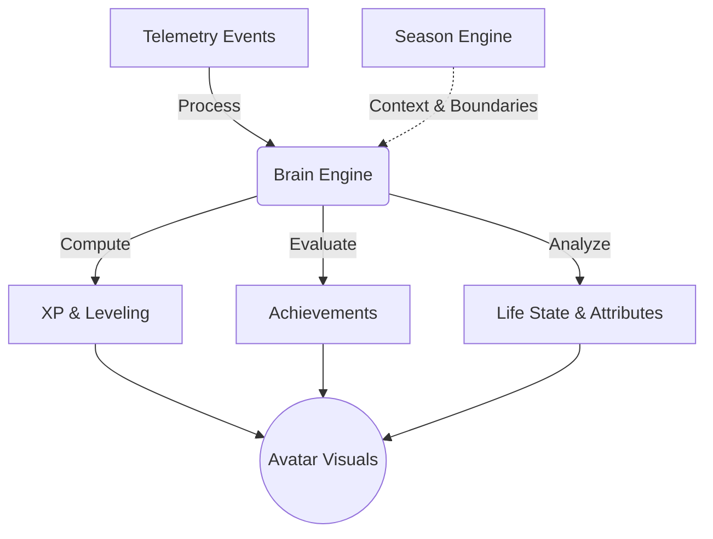

# Winter Arc Progression System

> [!NOTE]
> This document outlines the progression, leveling, achievements, avatar, and season systems for the Life OS Winter Arc campaign.
> Covers features F-15 through F-19 (Wave 3), plus F-02 (Avatar) and F-03 (Personal Stats).

## Status Overview
- **XP & Leveling System (F-15)**: [FUTURE]
- **Achievement System (F-16)**: [FUTURE]
- **Avatar System (F-02)**: [FUTURE]
- **Life State System (F-03)**: [FUTURE]
- **Season Engine (F-17)**: [FUTURE]

## Design Principles
- **Rewards MUST correspond to genuine activity.**
- **NO meaningless gamification.**
- **NO fake progress or inflated numbers.**
- **XP sources must be deterministic and explainable.**
- **Cosmetics are earned through real achievement.**
- **System must not create anxiety or unhealthy competition (single-player system).**

## XP Engine

> [!NOTE]
> XP is deterministically derived from canonical events (ADR-015). There are no `xp_transactions` or `user_levels` tables.

### XP Sources

> [!WARNING]
> Values proposed below are subject to calibration during implementation.

| Activity | XP | Conditions |
|----------|-----|------------|
| Habit completion | 10-25 | Per habit, daily cap |
| Streak maintenance (7-day) | 50 | Per streak milestone |
| Streak maintenance (30-day) | 200 | Per streak milestone |
| Focus session (30+ min) | 15-30 | Based on duration |
| Deep work (120+ min) | 50 | Daily bonus |
| Workout completed | 30-50 | Per workout |
| Personal Record (PR) | 100 | Per new PR |
| Learning session logged | 15-25 | Per session |
| Learning milestone achieved | 75 | Per milestone |
| Task completed | 5-15 | Per task |
| Journal entry | 20 | Per entry |
| Weekly plan created | 25 | Per week |
| Weekly review submitted | 50 | Per review |
| Evening Sync completed | 15 | Daily |
| Season milestone | 200 | Per milestone |
| Consistency bonus (7 modules active) | 100 | Weekly |

### XP Anti-Gaming Rules
- Daily XP cap per category (prevents spam-logging).
- No XP for deleted/undone actions.
- No XP retroactive awards.
- XP amounts are deterministic, not random.

## Leveling System
- **XP Curve**: XP thresholds per level use an exponential curve.
  - Level 1: 0 XP
  - Level 2: 100 XP
  - Level 3: 300 XP
  - Level 4: 600 XP
- **Title Progression**: Novice -> Apprentice -> Builder -> Strategist -> Master -> Legend.
- **Infinite Progression**: No level cap.
- **Display Only**: Level is DISPLAY ONLY; no gameplay features or data are gated by level.

## Achievement System

### Achievement Categories
1. **Consistency:** Streak milestones (7, 14, 30, 60, 90, 180, 365 days).
2. **Depth:** Focus time milestones (10h, 50h, 100h, 500h, 1000h).
3. **Breadth:** Multi-domain activity (all 7 domains active in one day/week).
4. **Learning:** Roadmap completions, milestone achievements.
5. **Fitness:** Workout milestones, PR count milestones.
6. **Seasonal:** Season-specific achievements (e.g., Winter Arc completion).
7. **Meta:** System achievements (first Evening Sync, first report generated).

### Achievement Storage
- **Definitions**: Maintained as TypeScript constants (code-only, not in the database) to adhere to the principle of DO NOT OVER-ENGINEER.
- **Unlocks**: Stored in the `user_achievements` table (ADR-016) to allow efficient querying for the Avatar UI without scanning the entire append-only events table.

## Avatar System

### Canonical Personal Attributes (7)
| Attribute | Source Data | Computation |
|-----------|------------|-------------|
| Focus | `time_logs` (Deep Work) | Rolling 14-day deep work minutes |
| Discipline | `habit_logs`, streaks | Habit completion rate + streak length |
| Consistency | `data_lab_module_consistency_30d` | Cross-module consistency % |
| Learning | `learning_session_logs` | Sessions logged + roadmap progress |
| Execution | `tasks` completed | Task completion rate |
| Physical | `workouts`, `exercise_logs` | Workout frequency + variety |
| Recovery | `journal_entries`, mood | Journal frequency + mood patterns |

> [!IMPORTANT]
> All attribute scores MUST be deterministic and fully explainable by real data.

### Avatar Visual Progression
- Base avatar created at signup.
- Visual upgrades tied to levels and achievements.
- **Cosmetics Catalog**: [FUTURE] requires further design work.
- **Environment**: Backgrounds and themes change based on the active season.
- **Implementation**: Composable SVG (ADR-013).

## Life State System

### Canonical Life States
| State | Trigger Conditions |
|-------|-------------------|
| Recovering | Momentum < 20, recent streak breaks, low activity |
| Stable | Momentum 20-45, moderate consistency |
| Building | Momentum 45-65, rising trend, consistent activity |
| Accelerating | Momentum > 65, rising trend, high multi-domain activity |
| Overloaded | High activity but declining quality signals |
| Drifting | Falling trend, gaps in multiple domains |

*Life State is computed dynamically from the existing Brain Engine momentum and domain signals. No new data architecture is required.*

## Season Engine

### Season Data Model
- `seasons` table schema: `(id, user_id, name, start_date, end_date, theme, objective, status, config jsonb)`
- **First Season**: Winter Arc 2026.
- One active season per user at a time.
- Season milestones linked directly to the progression system.
- Generates season reports at conclusion.

### Architectural Recommendation
> [!TIP]
> **Design Decision:** Use a lightweight `seasons` table for metadata rather than complex configuration files.
> - Season progress should be derived dynamically from activity within the date range.
> - Avoid building a complex seasonal management platform.

## Cross-References
- [Winter Arc Master Plan](file:///C:/Users/gpk74/life-os/docs/winter-arc/WINTER_ARC_MASTER_PLAN.md)
- [Winter Arc Data Model](file:///C:/Users/gpk74/life-os/docs/winter-arc/WINTER_ARC_DATA_MODEL.md)
- [Winter Arc Telemetry](file:///C:/Users/gpk74/life-os/docs/winter-arc/WINTER_ARC_TELEMETRY.md)
- [System Architecture](file:///C:/Users/gpk74/life-os/docs/architecture/SYSTEM_ARCHITECTURE.md)
