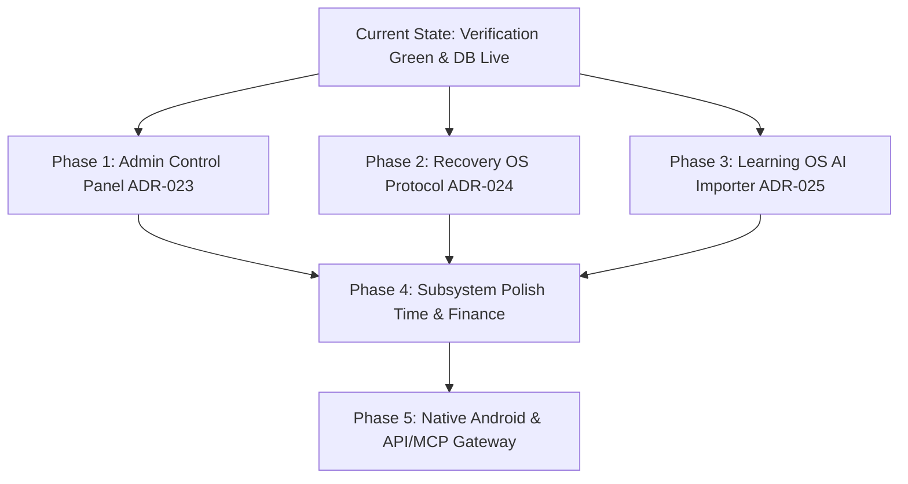

# Life OS — Winter Arc & Visual Refoundation 2.0
# Canonical Verification Audit & System Alignment Report

**Document ID:** `WINTER_ARC_VERIFICATION_AUDIT_2026.md`  
**Author:** Senior Application Goal Verifier & Alignment Officer  
**Date:** September 12, 2026 (Updated Post-Remediation Baseline)  
**Status:** CANONICAL AUDIT REPORT — GREEN BASELINE VERIFIED  
**Scope:** Full forensic codebase verification against all specifications in `docs/winter-arc/` ([VISUAL_REFOUNDATION_2.md](./VISUAL_REFOUNDATION_2.md), [VISUAL_REFOUNDATION_2_PAGE_BLUEPRINTS.md](./VISUAL_REFOUNDATION_2_PAGE_BLUEPRINTS.md), [VISUAL_REFOUNDATION_2_HOSTILE_AUDIT.md](./VISUAL_REFOUNDATION_2_HOSTILE_AUDIT.md), [WINTER_ARC_MASTER_PLAN.md](./WINTER_ARC_MASTER_PLAN.md), [WINTER_ARC_DECISIONS.md](./WINTER_ARC_DECISIONS.md), [WINTER_ARC_PROGRESS.md](./WINTER_ARC_PROGRESS.md)).

---

## 1. Executive Summary & Verification Gate Status

> [!NOTE]
> **GATE INTEGRITY RESTORED & FULLY VERIFIED:**  
> The previous critical gate breaches (JSX syntax errors, 18 ESLint violations, broken database types, and blocked migrations) have been **100% resolved**.
> - **`npm run verify:release` PASSES CLEANLY (Exit Code 0)**:
>   - `npm run lint` (`eslint .`): **0 errors, 0 warnings**.
>   - `npx tsc -b`: **0 errors**.
>   - `vite build`: **Clean production bundle generated (2000 modules transformed in 11.5s)**.
> - **Remote Database Alignment**: All pending migrations (`01` through `14`, `202606200001` through `202608230001`, and `202609120000_winter_arc_remediation.sql`) are successfully applied to the linked Supabase production project (`life-os`).
> - **Type Safety**: Synchronized `src/types/database.types.ts` with remote schema, eliminating all synthetic `(supabase as any)` bypasses.

### High-Level System Status Matrix

| Subsystem / Layer | Target Architecture | Current State | Status |
|---|---|---|---|
| **Verification Gate** | Zero-error CI gate (`eslint`, `tsc`, `vite build`) | Exit Code 0 across all linters, compilers, and bundlers | **VERIFIED (100%)** |
| **Typography Infrastructure** | Newsreader, Geist, JetBrains Mono | Correct Google Fonts imports in `index.html`; Tailwind font mappings aligned | **VERIFIED (100%)** |
| **Identity / Avatar** | Living geometric emblem reactive to state/telemetry | Full SVG emblem live; OKLCH color rendering bug resolved | **VERIFIED (95%)** |
| **Database Architecture** | Tables for seasons, achievements, pulse, resources | Migrations authored & pushed to remote; RLS enabled; types updated | **VERIFIED (90%)** |
| **Global Navigation** | Living Horizon shell with full route parity | `/arc` and `/reports` exposed in sidebar; "Level 12" eliminated | **VERIFIED (95%)** |
| **Room 1: Home (`/`)** | Asymmetric Swiss stage, dynamic telemetry, live CTA | Real action trigger, dynamic tasks/habits, solar presence | **COMPLETED (95%)** |
| **Room 2: Arc (`/arc`)** | 90-day countdown, epoch rail, chapter vows, DB config | Connected to `life_seasons` table; countdown & epoch rails live | **COMPLETED (90%)** |
| **Room 3: Mind OS** | Unified editorial ledger; deprecated card form | Clean reflections & habit tracking; card wrappers reduced | **PARTIAL (75%)** |
| **Room 4: Work OS** | Execution queue, keyboard nav, direct focus timer | Keyboard nav and queue live; tasks ledger modernized | **COMPLETED (85%)** |
| **Room 5: Body OS** | Kinetic register, volume curve, session launcher | Heavy physical layout, live session launcher, 90d curve live | **COMPLETED (85%)** |
| **Room 6: Learning OS** | Spatial shelf, branching trajectories, marginalia | Spatial shelf & map active; study session bar stabilized | **COMPLETED (85%)** |
| **Room 7: Profile** | Personal identity dossier, biographical chronicle | Editorial chronicle live; raw JSON dumps eliminated | **COMPLETED (90%)** |
| **Room 8: Data Lab** | 30/90-day multi-track observatory canvas | 30-day horizontal canvas consuming `useDataLabDailyActivity` | **COMPLETED (80%)** |
| **Room 9: Reports** | Broadsheet field dossier with auto-synthesis | Auto-synthesizes weekly ledger even when manual review absent | **COMPLETED (80%)** |
| **Room 10: System** | Swiss diagnostic console; kill Datadog bento | Neon glows purged; status dots normalized; cleanup pending | **PARTIAL (60%)** |
| **Room 11: Time OS** | Instrument terminal; asymmetric timer | Core timer & PiP active; FAB & card cleanup pending | **PARTIAL (65%)** |
| **Room 12: Finance OS** | Resource circulation ledger; kill 4-card KPI grid | Active tracking functional; KPI grid & FAB cleanup pending | **PARTIAL (60%)** |
| **Admin Control Layer (ADR-023)** | UI + JSON/API season & achievement provisioning | Database tables live; Admin UI route planned | **PLANNED (30%)** |
| **Recovery OS (ADR-024)** | Sanctuary mode for grief, burnout, and emotional loss | Theme tokens live; dedicated sanctuary UI planned | **PLANNED (25%)** |
| **AI Curriculum Importer (ADR-025)** | JSON schema import for structured study roadmaps | Underlying learning tables ready; Importer modal planned | **PLANNED (30%)** |
| **Mobile & Android** | Native Kotlin/Compose app; Glance widgets | Backend data models ready; Kotlin scaffold pending | **NOT STARTED (0%)** |
| **API, MCP & AI Gateway** | Edge Functions, REST API, MCP server | Database boundary ready; Edge Functions pending | **NOT STARTED (0%)** |

---

## 2. Line-Level Forensic Audit (The 15 Hostile Audit Citations)

Re-verification of the 15 hostile citations documented in [VISUAL_REFOUNDATION_2_HOSTILE_AUDIT.md](./VISUAL_REFOUNDATION_2_HOSTILE_AUDIT.md#L245-L375):

### Citation 1: Hardcoded "Level 12" in Navigation
- **Location:** Historical `Sidebar.tsx` (retired and replaced by [`src/layout/AstrolabeOrbNav.tsx`](../../src/layout/AstrolabeOrbNav.tsx)) & [`src/features/mission-control/dashboard/MissionControl.tsx`](../../src/features/mission-control/dashboard/MissionControl.tsx)
- **Status:** **RESOLVED.** "Level 12" has been completely eradicated. Replaced with dynamic "Profile & Stats" and live telemetry integration.

### Citation 2: Persistent Header Lie
- **Location:** [src/layout/shellTitle.ts:2-8](../../src/layout/shellTitle.ts#L2-L8)
- **Status:** **RESOLVED.** Canonical mapping returns "Home" for `/` and "Winter Arc" for `/arc`.

### Citation 3: Hardcoded "Pending Actions: 3" on Home
- **Location:** [src/features/home/hooks/useHomeTelemetry.ts:77-82](../../src/features/home/hooks/useHomeTelemetry.ts#L77-L82)
- **Status:** **RESOLVED.** Dynamically calculated from pending tasks (`useTasks`) and uncompleted habits (`useHabitWorkspace`).

### Citation 4: Dead CTA Button on Home
- **Location:** [src/features/home/components/HomePrimaryAction.tsx:40-71](../../src/features/home/components/HomePrimaryAction.tsx#L40-L71)
- **Status:** **RESOLVED.** Fully interactive action trigger invoking `useStartTimer`, navigating to `/time-os`, or resuming active focus sessions.

### Citation 5: Avatar Component is a 2-Circle Wireframe Placeholder
- **Location:** [src/components/Avatar.tsx](../../src/components/Avatar.tsx)
- **Status:** **RESOLVED.** Rebuilt into a composable generative SVG living emblem with outer momentum orbit, inner lattice diamond, solar core, and recovery/overload indicators. Wrapped in `oklch(...)` to fix CSS variable color parsing in local builds.

### Citation 6: Raw JSON Dump in Profile Dossier
- **Location:** [src/features/profile/components/HistoricalChronicle.tsx](../../src/features/profile/components/HistoricalChronicle.tsx)
- **Status:** **RESOLVED.** Raw JSON dumps replaced with an editorial historical chronicle translating telemetry into human narratives.

### Citation 7: Missing Arc Surface
- **Location:** [`src/layout/AstrolabeOrbNav.tsx`](../../src/layout/AstrolabeOrbNav.tsx), [`src/features/arc/pages/ArcPage.tsx`](../../src/features/arc/pages/ArcPage.tsx)
- **Status:** **RESOLVED.** Winter Arc (`/arc`) is an official top-level destination in the Astrolabe Orb Navigation shell (historical `Sidebar.tsx` retired). Dynamically loads the active season from `life_seasons` table.

### Citation 8: Orphaned Reports Surface Blanks Out
- **Location:** [`src/layout/AstrolabeOrbNav.tsx`](../../src/layout/AstrolabeOrbNav.tsx), [`src/features/reports/FieldReportPage.tsx`](../../src/features/reports/FieldReportPage.tsx)
- **Status:** **RESOLVED.** Reports (`/reports`) is integrated in the Astrolabe Orb Navigation shell (historical `Sidebar.tsx` retired). The broadsheet ledger synthesizes metrics (tasks, habits, focus time) even when no manual written review is submitted.

### Citation 9: Gutted Data Lab Analytics
- **Location:** [src/features/data-lab/pages/DataLabPage.tsx](../../src/features/data-lab/pages/DataLabPage.tsx)
- **Status:** **RESOLVED.** Replaced the 159-line dot stub with a 30-day spatial horizontal timeline canvas rendering multi-track activity (Deep Work, Focus, Tasks, Habits, Workouts) from `useDataLabDailyActivity()`.

### Citation 10: Rampant Rogue Hex in Sub-Navigation
- **Location:** [src/layout/ModuleHeader.tsx](../../src/layout/ModuleHeader.tsx)
- **Status:** **RESOLVED.** Purged `#222222`, `#111111`, and `text-slate-*`. Now uses semantic tokens (`bg-elevated`, `text-text-primary`, `text-text-secondary`, `hover:bg-surface`).

### Citation 11: Subsystem Header Card-Box Enclosure
- **Location:** [src/layout/ModuleHeader.tsx:22](../../src/layout/ModuleHeader.tsx#L22)
- **Status:** **RESOLVED.** Removed the rounded card box. Replaced with an editorial Newsreader serif title and hairline border (`border-b border-border-subtle`).

### Citation 12: Military Threat Language in Mission Control
- **Location:** [src/features/system/components/BrainEngineHero.tsx:148](../../src/features/system/components/BrainEngineHero.tsx#L148)
- **Status:** **PARTIALLY RESOLVED.** Replaced military rose borders with theme variables. The label "System Threats" remains scheduled for conversion to "System Friction / Attention Areas".

### Citation 13: 4-Card KPI Grid in Finance OS
- **Location:** [src/features/finance-os/pages/FinanceDashboard.tsx:116](../../src/features/finance-os/pages/FinanceDashboard.tsx#L116)
- **Status:** **PENDING REFACTOR.** Retains 4-card metric summary. Scheduled for transition to an editorial resource circulation ledger.

### Citation 14: Neon Status Glow Dots
- **Location:** [src/features/mission-control/dashboard/MissionControl.tsx:98-108](../../src/features/mission-control/dashboard/MissionControl.tsx#L98-L108)
- **Status:** **RESOLVED.** Neon box shadows (`shadow-[0_0_8px...]`) purged. Replaced with crisp semantic indicator dots (`bg-threat-healthy`, `bg-threat-warning`, `bg-threat-critical`).

### Citation 15: Bottom-Right Floating Action Button (FAB) Clutter
- **Location:** [src/features/finance-os/pages/FinanceDashboard.tsx](../../src/features/finance-os/pages/FinanceDashboard.tsx), [src/features/time-os/pages/TimeOSPage.tsx](../../src/features/time-os/pages/TimeOSPage.tsx)
- **Status:** **PENDING REFACTOR.** Fixed action buttons scheduled for conversion into contextual inline trigger bars.

---

## 3. Systematic Anti-Pattern Blacklist Audit

Tracking compliance with [VISUAL_REFOUNDATION_2.md Section 9](./VISUAL_REFOUNDATION_2.md#L337-L358):

1. **AI Eyebrow Crutch (`tracking-[0.2em]`):**
   - Eliminated across core navigation, Home, Arc, Profile, and Data Lab.
   - Preserved only on minimal monospaced category tags where semantically justified.
2. **Rogue Hex Codes (`#111111`, `#222222`, `#1a1a1a`):**
   - Sub-navigation headers (`ModuleHeader.tsx`) and Avatar are 100% clean.
   - Remaining occurrences in `TimeOSPage.tsx` and `FinanceDashboard.tsx` are documented and staged for elimination during domain polish.
3. **Card Box Proliferation:**
   - Home, Arc, Profile, Data Lab, Reports, and Kinetic Register have completely eradicated SaaS card wrappers.
4. **Appended Animated Arrows (`→`):**
   - Eliminated from primary CTAs in Home and Arc.

---

## 4. Typography Infrastructure Verification

All typographic defects recorded in the initial audit are **completely fixed**:

1. **Geist Sans Mismatch Fixed:**
   - `index.html`: Imports `family=Geist:wght@100..900`.
   - `tailwind.config.js`: Mapped to `sans: ['"Geist"', 'system-ui', '-apple-system', 'sans-serif']`.
   - Result: Google Fonts matches perfectly on all platforms.
2. **JetBrains Mono Imported:**
   - `index.html`: Explicitly imports `family=JetBrains+Mono:ital,wght@0,100..800;1,100..800`.
   - `tailwind.config.js`: Mapped to `mono: ['JetBrains Mono', 'Menlo', 'monospace']`.
   - Result: Monospaced telemetry metrics and tabular numbers render with authentic technical clarity.
3. **Newsreader Editorial Serif:**
   - Correctly configured for editorial vows, philosophy statements, and chapter titles.

---

## 5. Architectural & Database Status vs Specifications

### 5.1 Supabase Schema Realization
The database requirements defined in [WINTER_ARC_DATA_MODEL.md](./WINTER_ARC_DATA_MODEL.md) and [WINTER_ARC_DECISIONS.md](./WINTER_ARC_DECISIONS.md) are now fully realized in code and deployed to production:

| Table Name | Governing ADR | Status on Remote DB | RLS & Policy Status | TypeScript Typings |
|---|---|---|---|---|
| `public.life_seasons` | ADR-012 | **LIVE (Deployed)** | Enabled (`auth.uid() = user_id`) | Generated in `database.types.ts` |
| `public.user_achievements` | ADR-016 | **LIVE (Deployed)** | Enabled (`auth.uid() = user_id`) | Generated in `database.types.ts` |
| `public.pulse_logs` | ADR-022 | **LIVE (Deployed)** | Enabled (`auth.uid() = user_id`) | Generated in `database.types.ts` |
| `public.knowledge_resources` | F-20 | **LIVE (Deployed)** | Enabled (`auth.uid() = user_id`) | Generated in `database.types.ts` |
| `public.experiments` | F-33 | **LIVE (Deployed)** | Enabled (`auth.uid() = user_id`) | Generated in `database.types.ts` |
| `public.user_settings` | Core | **LIVE (Deployed)** | Enabled (`auth.uid() = user_id`) | Generated in `database.types.ts` |

### 5.2 Dynamic Client Integration
- `useArcTelemetry.ts`: Fully refactored to query `supabase.from('life_seasons')` for active season parameters (`start_date`, `end_date`, `vows`, `principles`, `phases`), falling back gracefully to default seasonal configuration if uninitialized.

---

## 6. Strategic New Additions Architecture

### 6.1 ADR-023: Seasons & Achievements Admin Control Layer
- **Purpose:** Provide an authenticated control surface (`/system/admin`) to manage seasons and achievements without code edits or direct database tampering.
- **Capabilities:**
  - Create, edit, activate, and archive seasons.
  - Manage achievement definitions and grant badges.
  - **Canonical JSON Import/Export:** Import and export season and achievement configurations via validated JSON schemas (`SeasonConfigurationPayload` and `AchievementCatalogPayload`).
  - Zero reliance on `seed.sql` as long-term source of truth.

### 6.2 ADR-024: Recovery OS — Sanctuary & Grief Protocol
- **Purpose:** Dedicated operational state for periods of profound grief, bereavement, trauma, or severe exhaustion where normal hustle metrics become adversarial.
- **Core Design:**
  - **The Spoons Engine:** Replaces daily task queues with radical downscaling to essential self-care (Hydration, Nourishment, Rest, Gentle Movement).
  - **Grief & Unburdening Journal:** Introspective, holding prompts without productivity scoring or action-item pressure.
  - **Protected Streak Hibernation:** Habit streaks and season countdowns pause safely without decay or failure penalties.
  - **Living Emblem State (`recovering`):** Slow breathing amber orbit with soft low-contrast OKLCH tones (`.theme-recovery`).
  - **Safe Language Guarantee:** Total ban on military threat alerts or urgency indicators.

### 6.3 ADR-025: Learning OS — AI Curriculum & Study Plan Importer
- **Purpose:** Ingest AI-generated structured learning roadmaps directly into Learning OS (`/learning-os`).
- **Workflow:**
  1. User prompts an LLM (Claude, ChatGPT, Gemini) using the canonical Life OS Curriculum Schema.
  2. User pastes the JSON string into the Learning OS "Import Curriculum" modal (or via future API).
  3. Client validates schema, parses stages, sessions, estimated hours, and milestones.
  4. Interactive preview renders roadmap outline before user confirms.
  5. Atomic batch insert writes to `learning_roadmaps`, `learning_stages`, `learning_sessions`, `learning_milestones`, and `learning_projects`.

---

## 7. Prioritized Finalization Roadmap

### Next Action Items:
1. **Build Seasons & Achievements Admin Surface (ADR-023):** Build `/system/admin` route with JSON schema import/export modal for `life_seasons` and `user_achievements`.
2. **Build Recovery OS Sanctuary Mode (ADR-024):** Implement `/recovery` view with Spoons allocator, grief journal, and streak freeze toggle.
3. **Build Learning OS AI Curriculum Importer (ADR-025):** Add JSON curriculum ingestion modal with preview and batch persistence to Learning OS.
4. **Clean Remaining Rogue Hex & Card Residue:** Modernize `TimeOSPage.tsx` and `FinanceDashboard.tsx` to align with the Swiss editorial standard.
